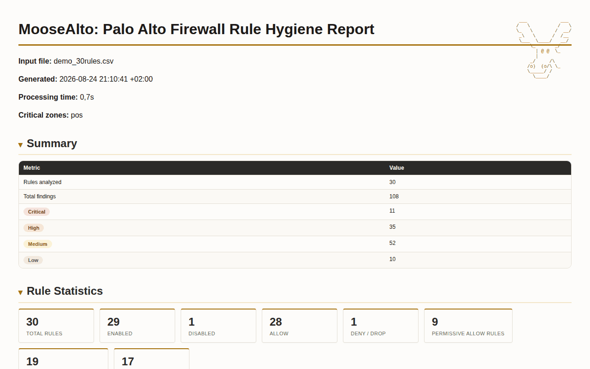

```
 ___            ___
/   \          /   \
\_   \        /  __/   MooseAlto
 _\   \      /  /__    Palo Alto Rule Hygiene Analyzer
 \___  \____/   __/    
     \_       _/
       | @ @  \_
       |               
     _/     /\         
    /o)  (o/\ \_
    \_____/ /
      \____/
```

[](https://github.com/g4bri-3l3/MooseAlto/blob/main/LICENSE)
[](https://github.com/g4bri-3l3/MooseAlto)

PowerShell tool that reviews a Palo Alto/Panorama security rulebase CSV export
and flags hygiene and exposure issues, combining Algorithmic rule-based
checks with an optional AI-assisted summary (Gemini).

## Example



A full sample report is in
[`examples/demo_report.html`](https://github.com/g4bri-3l3/MooseAlto/blob/main/examples/demo_report.html),
generated from
[`examples/demo_30rules.csv`](https://github.com/g4bri-3l3/MooseAlto/blob/main/examples/demo_30rules.csv):
a curated 30 rule ruleset that triggers a broad mix of the checks below.
Download it and open it in a browser to try the interactive column
filters and collapsible sections firsthand.

Also, in
[`examples/`](https://github.com/g4bri-3l3/MooseAlto/tree/main/examples):
- `rules_5000_with_objects.csv`, `address_objects_5000.csv`, and
  `address_groups_5000.csv`: a larger ruleset referencing named address
  objects and groups (including a nested group) instead of raw IPs, for
  trying `-AddressObjectsCsv`/`-AddressGroupsCsv` resolution
- `rules_usage_data_sample.csv`: the Policy Optimizer schema mentioned in
  Input format below

## Design principle

Anything with an exact & algorithmic answer is checked **in local**, not forwarded
to an LLM. The LLM is only used, optionally **(if you decide so)**, 
to write an executive-readable summary and suggest a remediation order over
findings that were already computed (**with IP addresses and other data masked**).

## Checks performed

**Internet-facing exposure** (at least one side of the rule touches the
internet, via zone name or a concrete public IP):
- `any_any_any_allow`: source zone/address, destination zone/address, and
  application all set to "any" with an allow action: the broadest possible
  rule.
- `inbound_from_internet`: allow rule reachable from the internet on the
  source side, worded to say whether the source is genuinely
  unrestricted (any) or scoped to one specific address reached through an
  unrestricted zone. It fires
  whenever the source touches the internet by any means, including a
  rule scoped to a single concrete allowlisted address where only the
  zone (not the address) is unrestricted. Medium, not High: on its own
  this is context (which rules make up the internet-facing surface), not
  a concrete risk. Whatever makes a specific rule actually dangerous (a
  risky app/port, no security profile, wide-open fields) already fires
  its own more specific Critical/High finding.
- `outbound_to_internet`: symmetric counterpart to `inbound_from_internet`
  for the destination side, same wording style and same Medium reasoning.
  Fills a gap the two checks below leave: a well-scoped outbound rule
  (specific destination, specific application) triggers neither of them,
  but still deserves to show up as "this rule reaches the internet" for
  the same contextual reason the inbound side does.
- `inbound_risky_application` / `inbound_risky_port`: inbound-from-internet
  rule matching a high-risk port or App-ID (see list below)
- `outbound_risky_application` / `outbound_risky_port`: same high-risk
  port/App-ID list, but for a purely outbound rule (source internal,
  destination internet). An internal host allowed to
  run RDP/SSH/Telnet out to arbitrary internet destinations is a real
  concern in its own right: a data-exfiltration or tunneling channel if
  that host is ever compromised, not just an internet-exposure question.
- `outbound_any_public_defined_app`: destination is any/internet-facing,
  but application is at least restricted (narrower than fully open, still
  worth a look).
- `outbound_defined_dest_any_app`: the mirror case: destination is scoped
  to specific address(es), but application/service is unrestricted (any).
- `no_security_profile_on_exposed_rule`: rule touches the internet
  (inbound or outbound) but has no security profile group applied (no
  threat prevention / antivirus / URL filtering inspection on that traffic).
- `negated_rfc1918_effectively_public`: an address field negates all
  three private RFC1918 ranges (e.g. `[Negate] 10.0.0.0/8;[Negate]
  172.16.0.0/12;[Negate] 192.168.0.0/16`), which is functionally
  equivalent to "any public address" even though no token literally says
  "any". Easy to miss in manual review.
- `internet_exposed_any_field`: general catch-all for a rule that touches
  the internet (either side) with source zone, source address,
  destination zone, destination address, application, or service left as
  "any" **or effectively any** (a negated- or positive-RFC1918 address
  field counts too, consistent with how direction classification already
  treats a negated field as reaching the internet). The narrower checks
  above only fire for specific single-field combinations; this one
  catches the gaps between them, such as a rule where both destination
  and application are "any" simultaneously, or a "Destination Zone: any"
  rule reaching both directions at once. Deliberately overlaps with the
  more specific findings above rather than replacing them. Normally
  High; escalates to **Critical** when source address, destination
  address, application, AND service are all any/effectively-any
  simultaneously (see the severity methodology section below for why).

**Critical zone isolation** (financial services: SWIFT, PCI DSS  only active if `-CriticalZones` is set, no universal
default since this is entirely org-specific):
- `unrestricted_access_to_critical_zone`: a non-critical zone reaches a
  configured critical zone (e.g. SWIFT secure zone, CDE, ATM, core
  banking, HSM) with source zone, source address, or application left
  unrestricted (or effectively unrestricted via the RFC1918 idiom, same
  as above). Fires independently of internet exposure: SWIFT CSCF and
  PCI DSS both require these zones isolated from the *general enterprise
  network*, not just from the internet. A Trust-zone workstation reaching
  the SWIFT zone unrestricted is a real finding even though neither side
  touches the internet.
- `unrestricted_egress_from_critical_zone`: the mirror case: a critical
  zone reaches OUT to a non-critical zone with destination zone,
  destination address, or application left unrestricted (or effectively
  unrestricted via the RFC1918 idiom). Isolation requirements apply in
  both directions: a host
  inside the critical zone with unrestricted egress can exfiltrate data
  or reach a C2 server just as easily as an attacker could reach in
  through an overly broad inbound rule.

**Internal traffic** (neither side touches the internet):
- `broad_internal_exposure`: internal-to-internal rule with source
  address, destination address, and/or application left unrestricted
  (any, or effectively any via the RFC1918 idiom). A common
  lateral-movement / ransomware-propagation pattern
- `internal_risky_application` / `internal_risky_port`: same
  high-risk port/App-ID list as the inbound checks, applied to purely
  internal traffic.

**Ruleset hygiene** (regardless of internet exposure):
- `duplicate_rule`: identical match criteria (zone, address, application,
  AND service/port) to an earlier enabled rule.
- `shadowed_rule`: fully covered by an earlier rule **with the same
  action**, checking zone, address, application, and service/port
  coverage together (a rule scoped to one specific port does not shadow
  a later rule on a different port, even if everything else matches).
  Can never be hit, effectively dead policy. Note: a single `any/any/any`
  allow rule near the top of a ruleset will cause every subsequent rule
  to be flagged this way.
- `allow_shadows_deny`: a DENY rule fully covered by an **earlier ALLOW**
  rule with equal-or-broader scope. Unlike same-action shadowing, this
  changes what the traffic actually does: the deny never fires, so
  whatever it was meant to block is actually permitted by the earlier
  rule. A false sense of security, not just dead policy.
- `deny_shadows_allow`: the mirror case: an ALLOW rule fully covered by
  an **earlier DENY** rule. The allow exception never fires, so the
  traffic it was meant to permit stays blocked. Not a security exposure.
  If anything, it's more restrictive than intended, but a functional bug
  worth fixing before someone "resolves" the symptom by adding an even
  broader rule higher up.
- `zero_hit_count`: recorded hit count of zero, detected from whichever
  column contains "Hit Count" in its name (only if your export has one).
- `rule_usage_unused` / `rule_usage_partially_used`: Panorama's own Rule
  Usage status (see [View Policy Rule
  Usage](https://docs.paloaltonetworks.com/ngfw/administration/monitoring/view-policy-rule-usage)),
  a categorical `used`/`unused`/`partially used` value computed across
  every managed firewall a rule applies to.
  Detected by scanning for a column whose values are entirely drawn from
  that 3-value set, rather than by column name.
- `stale_last_hit`: a rule with a positive hit count, but whose Last Hit
  date is older than `-StaleHitDays` (default 365). Not covered by
  `zero_hit_count`: this is a genuinely different case, a rule that was
  used at some point but hasn't matched traffic recently (e.g. a one-off
  access grant nobody uses anymore). Never fires on the same rule as
  `zero_hit_count` to avoid flagging the same underlying fact twice.
- `disabled_rule_present`: disabled rule but still present in the ruleset.
- `port_based_rule_missing_app_id`: Application left as `any` but Service
  names an explicit port instead of `application-default`. This loses
  App-ID-based visibility (app-hopping over non-standard ports, App-ID-
  specific threat signatures) regardless of whether the port itself is
  risky. A distinct concern from `inbound_risky_port`/`internal_risky_port`,
  which only fire for ports on the high-risk list. The finding text notes
  when an involved port is also cleartext or otherwise high-risk.
- `temporary_tag_but_broad_rule`: the rule name or its Tags contain a
  temp/POC/test/trial-like word (matched as a whole token split on `-`,
  `_`, space, or `.`, not a raw substring, so e.g. "Attempted-Migration"
  doesn't false-positive on "temp"), and the rule still has an
  unrestricted address or application (or effectively unrestricted via
  the RFC1918 idiom, same as `broad_internal_exposure` above). SWIFT
  CSCF specifically cites "broad allow-any entries added as a temporary
  change years ago and never removed" as a common audit finding.
- `temporary_tag_still_present`: the narrowly-scoped counterpart to the
  check above. A temp/POC/test-signaled rule that's already tightly
  scoped isn't a broad-exposure risk, but the name/tag is still a
  lifecycle signal someone meant to revisit and never did. Fires instead
  of (not alongside) `temporary_tag_but_broad_rule` for the same rule,
  since the two represent different urgency, not the same fact at two
  severities.
- `missing_explicit_intrazone_internet_deny`: ruleset-wide, not tied to
  one specific rule. PAN-OS denies interzone traffic by default but
  **allows intrazone traffic by default** (a zone talking to itself)
  unless a rule overrides it. For an internet-facing zone, that default
  applies to traffic hitting the firewall's own external-facing
  interface. Fires when no enabled deny rule exists anywhere in the
  ruleset with that zone as both source and destination and application
  unrestricted. Informational (Low): only matters if nothing else already
  covers it, and a broad `any -> any` deny, for instance, already
  satisfies this and suppresses the finding.
- `reaches_known_public_dns_resolver`: destination includes a well-known
  public DNS resolver (list below). Checked regardless of the rule's
  action being allow only, and independent of port/application, since
  DNS over HTTPS in particular can't be distinguished from ordinary
  HTTPS traffic by port alone (SSL inspection is needed).
- `plain_dns_to_unrestricted_destination`: rule allows plain DNS (port
  53) to any destination (unrestricted). Unencrypted queries can go to
  literally any server with no way to filter or inspect where they end
  up. A DNS-tunneling/exfiltration pattern, not just a resolver-bypass
  one, and not caught by the check above since that one requires the
  destination to be one specific known resolver, not "any".
- `plain_dns_to_known_resolver`: rule allows plain DNS (port 53 udp)
  specifically to a well-known public resolver, confirming (rather than
  just permitting) unencrypted DNS. Deliberately overlaps with
  `reaches_known_public_dns_resolver` above rather than replacing it:
  the query content itself is visible in cleartext to anyone observing
  the traffic here, which DoH/DoT to the same resolver would not expose.
- `oversized_address_list`: source or destination lists more than -MaxAddressListSize (default 25) individual addresses. A rule with lot of individually-enumerated addresses is just as hard to audit as one with "any", even though nothing here literally says so. Several firewall audit checklists specifically call this out as its own finding, distinct from the any/none-based checks above.
- `no_logging_enabled`: allow rule shows no evidence of logging in the Options field: neither "session start"/"session end" (PAN-OS's own logging settings) nor a Log Forwarding profile. Logging and forwarding are separate PAN-OS settings: a log entry is created locally on the firewall as soon as session start/end logging is on, regardless of whether a Log Forwarding profile also sends it elsewhere. Either signal alone is enough to not flag this, since a local, queryable audit trail already exists. Only checked when the Options column both exists AND has been confirmed to carry logging information somewhere in the ruleset; otherwise skipped entirely to avoid flagging every rule on an export type that doesn't include this detail in the first place.
- `rule_name_action_mismatch`: the rule name suggests it denies/blocks traffic (a token like "deny", "block", "drop") but Action is actually allow, or vice versa (a name suggesting "allow"/"permit" on a rule that's actually deny/drop). Whoever reads the ruleset by name alone would reasonably draw the wrong conclusion about what a rule does. Checked by exact token, not substring; a name containing both a deny-style and an allow-style token is skipped as ambiguous rather than guessed at. Applies regardless of action (the one check in this file that needs to see deny/drop rules too, not just allow ones).

**Known public DNS resolvers checked:** Google (8.8.8.8, 8.8.4.4),
Cloudflare (1.1.1.1, 1.0.0.1), Quad9 (9.9.9.9, 149.112.112.112, 9.9.9.10),
OpenDNS/Cisco Umbrella (208.67.222.222, 208.67.220.220), AdGuard DNS
(94.140.14.14, 94.140.15.15), CleanBrowsing (185.228.168.9, 185.228.169.9),
Control D (76.76.2.0, 76.76.10.0), DNS.WATCH (84.200.69.80, 84.200.70.40),
Comodo Secure DNS (8.26.56.26, 8.20.247.20), CIRA Canadian Shield
(149.112.121.10, 149.112.122.10), Yandex DNS (77.88.8.8, 77.88.8.1).
Sourced from [dnsprivacy.org's public resolver
list](https://dnsprivacy.org/public_resolvers/) plus each provider's own
site, cross-checked against independent aggregators. Deliberately doesn't
include the long tail of smaller/personal DNSCrypt and DoH operators
(the full [DNSCrypt/dnscrypt-resolvers
list](https://github.com/DNSCrypt/dnscrypt-resolvers) runs to hundreds of
entries, most identified by URL rather than a fixed IP anyway, since DoH
by nature is usually reached by hostname over ordinary HTTPS).

**High-risk ports checked:** 20/21 (FTP), 22 (SSH), 23 (Telnet), 25 (SMTP),
69 (TFTP), 110 (POP3), 143 (IMAP), 161 (SNMP v1/v2c), 389 (LDAP), 445 (SMB),
512/513/514 (Rexec/Rlogin/Rsh), 853 (DNS over TLS), 1433 (MSSQL), 1521 (Oracle DB), 1723 (PPTP),
3306 (MySQL), 3389 (RDP), 5432 (PostgreSQL), 5900 (VNC), 6379 (Redis),
8443 (HTTPS-Alt/Admin), 9200 (Elasticsearch), 27017 (MongoDB). Findings
explicitly flag which of these are **unencrypted/cleartext by design**
(FTP, Telnet, TFTP, POP3, IMAP, SNMP v1/v2c, Rexec/Rlogin/Rsh) versus
encrypted-but-still-risky management surfaces (SSH, RDP) or a different
concern entirely (DNS over TLS is encrypted, flagged because it bypasses
DNS-based security controls, not because it's insecure).

**High-risk applications (App-ID) checked:** ftp, ssh, telnet, smtp, tftp,
pop3, imap, snmp, ldap, ms-rdp, ms-sql-db, mysql, oracle, vnc, ms-ds-smb/smb,
rsh, rlogin, pptp, postgres, redis, mongodb, elasticsearch-base, anydesk,
teamviewer, logmein, logmein-gotomypc, splashtop, chrome-remote-desktop,
dns-over-https. **Verify these names against App-ID database (https://applipedia.paloaltonetworks.com/).**

## Comparing against a previous report

`-CompareTo <path-to-previous-findings.csv>` compares this run's findings
against an earlier run's findings CSV (the standard `report_TIMESTAMP.csv`
this script itself produces). Matched by (rule name, finding type). The real limitation is that renaming
a rule between runs makes its findings look "resolved" under the old name
and "new" under the new one, even though nothing about the underlying
issue changed - there's no attempt to track a rule's identity across a
rename.

When set, the Algorithmic-based Findings table gets an extra **Comparison**
column: `New` (wasn't flagged last time), `Resolved` (was flagged last
time, isn't now), or `Still present` (flagged both times). Findings that
are now resolved no longer have a row in the current run, so they're
added back in from the previous CSV and sorted into the table by severity
alongside everything else, rather than listed separately. A summary card
above the table shows the New/Resolved/Still-present counts at a glance.

## Internet Exposure Inventory

Beyond the specific findings above, the report includes a dedicated
**inventory section**: every enabled allow rule that touches the internet
on either side (inbound, outbound, or both), regardless of whether it also
triggered a specific finding.

**Direction** (Inbound / Outbound / Both sides internet-facing) prefers
whichever side has genuinely unambiguous evidence: a specifically named
internet zone (e.g. `Untrust`), or a literal public IP/CIDR, which can
only ever be an internet address. A `[Negate] X` address is treated
differently here than in the findings above: excluding one bounded range
still leaves in all of RFC1918 private space too, so the address could
just as easily be an internal host as a public one. It's real evidence of
possible exposure (still flagged by `internet_exposed_any_field` and the
inbound/outbound findings), but not proof of which direction traffic
actually flows. Reserving "Both sides" for cases where the OTHER side also
lacks unambiguous evidence.

## AI-assisted analysis (optional)

**Getting a Gemini API key:** Go to
[aistudio.google.com/api-keys](https://aistudio.google.com/api-keys), sign
in with a Google account, and click "Create API key".
Copy the key and set it as the `GEMINI_API_KEY` environment variable
before running MooseAlto (or pass it directly with `-ApiKey`; see Usage
below).

The deterministic report is generated and saved **first**, with real IP
addresses intact (local file only, **nothing leaves your machine at this
point**). Only afterward does the script ask, interactively, whether to send
anything to Gemini:

1. `Send the results (with IP addresses masked) to Gemini for additional
   analysis? (Y/N)`**: if no, the script stops here. If yes, every IP
   address/CIDR found in the finding text is replaced with a consistent
   placeholder (`IP-MASKED-1`, `IP-MASKED-2`, ...) before anything is sent.
2. `Send all findings, or only internet-exposure-related ones? (A=All,
   I=Internet)`**: lets you scope what Gemini sees: everything, or only
   the internet-facing categories.
3. `Also include rule Tags in the prompt sent to Gemini? They may contain
   sensitive information (Y/N)`**: Tags are free text written by whoever
   maintains the ruleset and could contain project codenames or internal
   notes; included only if you explicitly say yes.

**Disabled rules are never sent to Gemini**, regardless of the scope
choice. A disabled rule isn't an active risk, so there's nothing to
usefully prioritize about it. It still appears in the local deterministic
report.

If there are zero findings, or the chosen scope filters everything out,
the script skips the Gemini call entirely.

## Input format

A Panorama/PAN-OS security policy CSV export (Policies > Security >
PDF/CSV). The parser is built to handle real-world export quirks directly,
rather than assuming a clean schema:

- An unnamed leading row-number column (blank header). The header is
  read and repaired explicitly instead.
- Multi-value fields (zones, applications, addresses) separated with `;`
  within a single CSV cell, not `,` (since `,` is already the CSV
  delimiter). Zones can genuinely be multi-valued (e.g.
  `outside;zone-to-hub`).
- Address values can be a plain CIDR/IP (real containment logic applies),
  an IP range (`10.0.0.0-10.255.255.255`), a `[Negate] ...` exclusion, or
  an address-object/group name. The latter three are kept as opaque
  tokens (exact-match only), not resolved to true containment.
- `Disabled` and `Rule Usage: Hit Count` columns are optional. Not every
  export type includes them (e.g. a plain rulebase config export vs. a
  rule-usage report). When absent, rules are assumed enabled and the
  zero-hit check simply doesn't run, with a console note either way.
- On some exports seen, there's no `Disabled`
  column at all. Disabled status is instead embedded directly in the
  `Name` field as a `[Disabled] ` prefix (e.g. `[Disabled] Old-Rule`).
  This is detected as a fallback, the prefix is stripped from the
  displayed rule name, and the rule is correctly treated as disabled
  (skipping all active-risk checks) either way.

**Note on PAN-OS/Panorama version differences**: the core schema
(including the blank leading column) has been confirmed against real
exports from **PAN-OS 10**, **PAN-OS 11**, and **PAN-OS 12**.
`rules_paloalto_sample.csv` matches the PAN-OS 12 schema exactly. 
Palo Alto's own documentation also confirms the core field names
(Source Zone, Destination Zone, Application, etc.) have been stable
across all the versions.

If a different PAN-OS version renames a *column* outright, that's a
distinct risk: a silent lookup miss would otherwise make the report look
complete while actually treating that field as blank for every rule. To
avoid that, the script checks for the core columns (`Name`, `Source
Zone`, `Source Address`, `Destination Zone`, `Destination Address`,
`Application`, `Service`, `Action`) right after loading and prints an
explicit warning if any are missing, rather than failing silently.

See `rules_paloalto_sample.csv` for a working example covering every check.
For `zero_hit_count`, `stale_last_hit`, `rule_usage_unused`, and
`rule_usage_partially_used` specifically, see `rules_usage_data_sample.csv`
instead: a separate file with Hit Count/Last Hit/Rule Usage columns
(from Policy Optimizer's rule usage view, a different export than the
plain security rulebase, so kept out of the main sample to avoid
misrepresenting its schema; see https://docs.paloaltonetworks.com/ngfw/administration/monitoring/view-policy-rule-usage)

## Address object / group resolution (optional)

By default, address-object and address-group names in a rule (e.g. a rule
whose source is `LAN-SERVER` rather than a literal CIDR) are treated as
**opaque tokens**, compared by exact string match only, not real
containment. Passing `-AddressObjectsCsv` and/or `-AddressGroupsCsv`
resolves these names to their actual member IP(s)/CIDR(s) first, so
duplicate/shadow detection and internet-exposure checks work on the real
underlying addresses instead of the object name.

- Nested groups are resolved recursively.
- `ip-netmask` objects resolve to real CIDR containment logic; `ip-range`
  and `fqdn` objects, and dynamic (tag-match) groups, can't be resolved to
  a single CIDR. They're kept as clearly-labeled opaque tokens instead
  (e.g. `Internal-DNS[fqdn]=dns.internal.corp`), same exact-match
  treatment as an unresolved name.
- The report's rule detail text still shows the **original object name**
  for readability. Only the underlying address comparison logic uses the
  resolved value.

**Schema**
- Address Objects: `Name,Location,Type,Address,Tags`
- Address Groups: `Name,Location,Members Count,Addresses,Tags` (note:
  **no `Type` column**. Static vs. dynamic can't be determined directly.
  This is handled by the code: a dynamic group's tag-match expression won't
  match any known object/group name, so it just falls through to the
  same "unknown name, stays opaque" behavior as an unresolved name.
  `Members Count` is used as a cross-check. If the resolved member count
  doesn't match, a console warning flags a likely separator mismatch.)

```powershell
.\MooseAlto.ps1 -InputCsv export.csv -OutHtml report.html -OutCsv report.csv `
  -AddressObjectsCsv address_objects.csv -AddressGroupsCsv address_groups.csv
```

## Risk classification methodology

Severity is assigned by **where a finding sits relative to direct
internet exploitability**:

- **Critical**: reachable directly from the internet with a known
  dangerous protocol, or the single broadest possible policy
  misconfiguration:
  - `any_any_any_allow`
  - `inbound_risky_application` / `inbound_risky_port`
  - `outbound_risky_application` / `outbound_risky_port`
  - `allow_shadows_deny`
  - `unrestricted_access_to_critical_zone`
  - `unrestricted_egress_from_critical_zone`
  - `internet_exposed_any_field` **only** when address, application, and
    service are all "any" simultaneously (see the callout below);
    otherwise High
- **High**: internet-facing exposure that isn't tied to one specific
  named protocol, missing inspection on traffic that's already exposed, a
  false sense of security (a rule that looks protective but can never
  fire), or a risky protocol reachable through lateral movement rather
  than directly from the internet:
  - `no_security_profile_on_exposed_rule`
  - `shadowed_rule`
  - `internal_risky_application` / `internal_risky_port`
  - `negated_rfc1918_effectively_public`
  - `internet_exposed_any_field` in the common case (see Critical above
    for the escalated case)
- **Medium**: widens the attack surface or adds ruleset debt, but
  doesn't by itself grant an attacker anything they couldn't already
  reach some other way documented above:
  - `inbound_from_internet` / `outbound_to_internet`
  - `outbound_any_public_defined_app` / `outbound_defined_dest_any_app`
  - `reaches_known_public_dns_resolver`
  - `plain_dns_to_unrestricted_destination`
  - `plain_dns_to_known_resolver`
  - `broad_internal_exposure`
  - `duplicate_rule`
  - `deny_shadows_allow`
  - `zero_hit_count`
  - `rule_usage_unused`
  - `stale_last_hit`
  - `port_based_rule_missing_app_id`
  - `temporary_tag_but_broad_rule`
- **Low**: low/informational, no active risk:
  - `disabled_rule_present`
  - `rule_usage_partially_used`
  - `missing_explicit_intrazone_internet_deny`
  - `temporary_tag_still_present`

**Notes:**
- **`shadowed_rule` is High** A dead rule isn't itself
  exploitable, but it's classified above simple hygiene items because it
  represents a *false sense of security*: whoever wrote it believed it
  was doing something protective, and it silently isn't.
- **Internal risky-protocol findings (`internal_risky_*`) are High, not
  Critical**, even though they use the same port/App-ID list as the
  Critical internet-facing findings. The distinguishing factor is
  reachability: exploiting them requires an attacker to already have an
  internal foothold, whereas the Critical inbound findings are reachable
  directly from the internet with no prior access needed.
- **`allow_shadows_deny` (Critical) and `deny_shadows_allow` (Medium) are
  intentionally asymmetric**, even though both describe a rule that can
  never fire. When an earlier allow shadows a later deny, the traffic the
  deny was meant to block is actually wide open, a real exposure. When
  an earlier deny shadows a later allow, the traffic stays blocked, more
  restrictive than intended, a functional bug rather than a security gap.
- **`internet_exposed_any_field` escalates to Critical** when source
  address, destination address, application, AND service are all
  literally "any" simultaneously, regardless of whether the side touching
  internet got there via the literal zone name "any" or a specifically
  named internet zone (e.g. "outside"). Without this, a rule scoped to a
  named internet zone but otherwise just as open as `any_any_any_allow`
  only ever reached High. `any_any_any_allow` itself only fires on the
  literal string "any", so a functionally identical rule reached through
  a named zone was understated.

This ranking also drives report ordering (`$SeverityOrder`:
Critical=0, High=1, Medium=2, Low=3) and it's the same ranking the AI
summary is told to respect when proposing a remediation order.

## File structure

```
MooseAlto.ps1   main script: params + orchestration
lib/
  IpHelpers.ps1        CIDR/IP parsing and containment
  Parsing.ps1          CSV / rule / address-object parsing
  DetectionRules.ps1   risky ports/apps data + all finding logic
  Reporting.ps1        Markdown/HTML rendering + Gemini integration
```

**`lib/DetectionRules.ps1` is the file to edit** when adding or tuning a
check. It holds the risky-port/App-ID lists and `Invoke-DeterministicChecks`,
the actual logic behind every finding type in this README. The other three
files rarely need to change once working. The main script locates them via
`$PSScriptRoot`, so the `lib` folder must sit next to the main script but
works regardless of which directory you run the script from.

If the script is launched with no `-InputCsv` (e.g. double-clicked instead of run from a command line), it
walks through an interactive setup instead of erroring out. Press Enter
on any prompt to accept the default shown in `[brackets]`. Once a CSV path
is known (via prompt or parameter), everything proceeds exactly the same
way. The optional Gemini call shows a live spinner while waiting on the
network request.

If `-OutHtml`/`-OutCsv` aren't specified, both default filenames include a
shared timestamp (`report_yyyyMMdd_HHmmss.html` / `.csv`). A second
CSV covering the Internet Exposure Inventory is always written alongside
the findings one, named `<OutCsv base>_inventory.csv`.

The report opens with a **Summary** table (rules analyzed, total
findings, and a severity breakdown) before the findings table itself,
color-coded the same way as the findings rows.

**Performance on large rulesets.** The duplicate/shadow detection
checks compare each rule against earlier ones, which is naturally
expensive as a ruleset grows. This is mitigated by grouping candidates
by zone-pair signature first (two rules can only match/shadow each other
if their zones are compatible), so a rule mostly only gets compared
against others that could plausibly match rather than every earlier rule
unconditionally.

## Requirements

Windows PowerShell 5.1 or PowerShell 7+, no external modules needed.

## Usage

```powershell
$env:GEMINI_API_KEY = "..."   # only needed if you plan to use AI analysis

.\MooseAlto.ps1 -InputCsv export.csv -OutHtml report.html -OutCsv report.csv

# Different zone naming convention (default: untrust,internet,outside,external):
.\MooseAlto.ps1 -InputCsv export.csv -OutHtml report.html -OutCsv report.csv -InternetZones "untrust,wan"

# Financial services: flag unrestricted access into sensitive zones.
# (SWIFT secure zone, CDE, ATM, core banking, HSM: name your own zones):
.\MooseAlto.ps1 -InputCsv export.csv -OutHtml report.html -OutCsv report.csv -CriticalZones "swift,cde,atm,core-banking,hsm"

# Flag rules unused in the last 6 months instead of the default 1 year:
.\MooseAlto.ps1 -InputCsv export.csv -OutHtml report.html -OutCsv report.csv -StaleHitDays 180

# Deterministic checks only, no prompts, no API calls:
.\MooseAlto.ps1 -InputCsv export.csv -OutHtml report.html -OutCsv report.csv -SkipLLM
```
## Known limitations

- **Zone-name dependent.** If your environment doesn't use a zone named
  `untrust`/`internet`/`outside`/`external` for the internet-facing
  interface, pass `-InternetZones` explicitly, or internet-exposure checks
  will under-report.
- **IPv4 only.** Containment (used by shadow/duplicate detection) does real interval math for plain CIDR/IP and "IP-IP" ranges, including mixing the two (e.g. correctly detecting that a range is fully inside a broader CIDR). A [Negate] X broader side (or multiple, which combine with AND semantics, matching only if the address avoids all of them) is also handled against a plain CIDR/range narrower side: covered if the narrower interval has zero overlap with every excluded range. Two narrower cases still fall back to exact string match rather than true containment: a [Negate] narrower side (rare enough in practice not to be worth the added complexity), and comparing two different negated expressions to each other (identical ones still match exactly, just not a genuinely different-but-overlapping pair). Address-object names are also exact-match, but only actually matters when -AddressObjectsCsv isn't supplied: when it is, names are resolved to real addresses before any comparison happens.
- **This is a hygiene review aid, not an authoritative security audit.**
  Always have a human review findings, especially `shadowed_rule` and
  anything touching the internet, before changing production policy.
- **App-ID risky-application names are best-effort**, not pulled from a live
App-ID database. Verify before trusting a "clean" result on
application-based rules. Palo Alto updates App-ID definitions regularly
via content-pack updates, so names can be renamed or added over time.
- **Large rulesets (roughly 6,000+ rules) get noticeably slow.** The
  duplicate/shadow detection checks are fundamentally n^2: every rule
  gets compared against earlier ones. Zone-pair bucketing (see
  Performance above) cuts the constant factor a lot by skipping
  comparisons between rules whose zones could never match, but doesn't
  change that underlying shape, since a fixed, small number of distinct
  zones means each zone-pair bucket still grows roughly linearly with
  ruleset size. In a few test made, 4,000 rules finishes in about a minute;
6,000 rules took over two minutes for detection alone; 20,000 rules
took ~ 15 minutes.

## Changelog

See CHANGELOG.md for release history.

## License

MIT. See
[LICENSE](https://github.com/g4bri-3l3/MooseAlto/blob/main/LICENSE).
