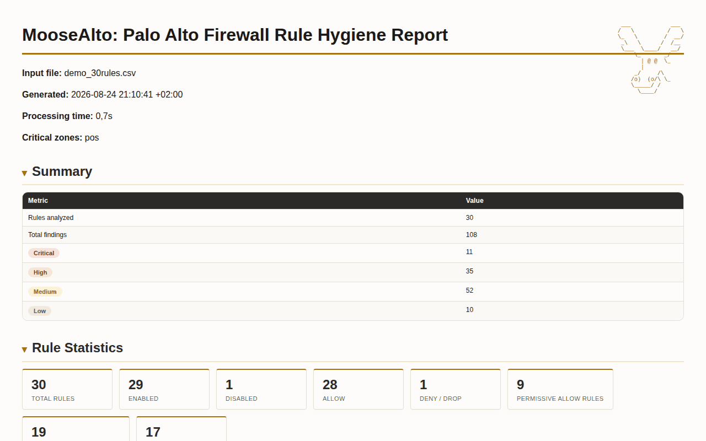

```
 ___            ___
/   \          /   \
\_   \        /  __/   MooseAlto
 _\   \      /  /__    Firewall Rule Hygiene Analyzer
 \___  \____/   __/    
     \_       _/
       | @ @  \_
       |               
     _/     /\         
    /o)  (o/\ \_
    \_____/ /
      \____/
```

[](https://github.com/g4bri-3l3/MooseAlto/blob/main/LICENSE)
[](https://github.com/g4bri-3l3/MooseAlto)

PowerShell tool that reviews a firewall security rulebase and flags hygiene
and exposure issues, combining Algorithmic rule-based checks with an
optional AI-assisted summary (Gemini).

| Vendor | Input | |
|---|---|---|
| Palo Alto Networks (PAN-OS, Panorama) | security rulebase CSV export | `-InputCsv` |
| Fortinet FortiGate (FortiOS 6.x, 7.x) | configuration file, optional hit counter JSON | `-InputConfig` |
| Juniper SRX (Junos) | `display set` or hierarchical configuration, optional hit count output | `-InputConfig` |
| Microsoft Azure Network Security Groups | `az network nsg list -o json` | `-InputConfig` |
| AWS EC2 security groups | `aws ec2 describe-security-groups` | `-InputConfig` |
| Google Cloud VPC firewall rules | `gcloud compute firewall-rules list --format=json` | `-InputConfig` |

Every vendor goes through the same checks: FortiGate, SRX and cloud
configurations are imported into the same rule model as a PAN-OS export
(see [Input formats](#input-formats)), and the few checks whose meaning
depends on the platform adapt to it.

## Example



A full sample report is in
[`examples/demo_report.html`](https://github.com/g4bri-3l3/MooseAlto/blob/main/examples/demo_report.html),
generated from
[`examples/demo_30rules.csv`](https://github.com/g4bri-3l3/MooseAlto/blob/main/examples/demo_30rules.csv):
a curated 30 rule ruleset that triggers a broad mix of the checks below.
Download it and open it in a browser to try the interactive column
filters and collapsible sections firsthand.

Also, in
[`examples/`](https://github.com/g4bri-3l3/MooseAlto/tree/main/examples):
- `rules_5000_with_objects.csv`, `address_objects_5000.csv`, and
  `address_groups_5000.csv`: a larger ruleset referencing named address
  objects and groups (including a nested group) instead of raw IPs, for
  trying `-AddressObjectsCsv`/`-AddressGroupsCsv` resolution
- `rules_usage_data_sample.csv`: the Policy Optimizer schema mentioned in
  Input format below
- `fortigate_demo_30rules.conf` + `fortigate_demo_30rules_stats.json`, and
  `srx_demo_30rules.set` + `srx_demo_30rules_hitcount.txt`: the same 30
  rules as `demo_30rules.csv`, as a FortiGate (NGFW policy-based mode)
  and a Juniper SRX configuration with their hit counters, for trying
  `-InputConfig`:

  ```powershell
  .\MooseAlto.ps1 -InputConfig examples\fortigate_demo_30rules.conf -HitCountFile examples\fortigate_demo_30rules_stats.json -CriticalZones "swift,cde"
  .\MooseAlto.ps1 -InputConfig examples\srx_demo_30rules.set -HitCountFile examples\srx_demo_30rules_hitcount.txt -CriticalZones "swift,cde"
  ```
- `corner_cases_1000.csv`, `fortigate_corner_cases_1000.conf` +
  `_stats.json`, `srx_corner_cases_1000.set` + `_hitcount.txt`: 1,000
  rules written to trigger almost every check and its corner cases, on
  all three vendors (see Testing). Run with `-CriticalZones "swift,cde"`.
  The last hit dates are relative to September 2026, so `stale_last_hit`
  grows as time passes.

## Design principle

Anything with an exact & algorithmic answer is checked **in local**, not forwarded
to an LLM. The LLM is only used, optionally **(if you decide so)**, 
to write an executive-readable summary and suggest a remediation order over
findings that were already computed (**with IP addresses and other data masked**).

## Checks performed

**Internet-facing exposure** (at least one side of the rule touches the
internet, via zone name or a concrete public IP):
- `any_any_any_allow`: source zone/address, destination zone/address, and
  application all set to "any" with an allow action: the broadest possible
  rule.
- `inbound_from_internet`: allow rule reachable from the internet on the
  source side, worded to say whether the source is genuinely
  unrestricted (any) or scoped to one specific address reached through an
  unrestricted zone. It fires
  whenever the source touches the internet by any means, including a
  rule scoped to a single concrete allowlisted address where only the
  zone (not the address) is unrestricted. Medium, not High: on its own
  this is context (which rules make up the internet-facing surface), not
  a concrete risk. Whatever makes a specific rule actually dangerous (a
  risky app/port, no security profile, wide-open fields) already fires
  its own more specific Critical/High finding.
- `outbound_to_internet`: symmetric counterpart to `inbound_from_internet`
  for the destination side, same wording style and same Medium reasoning.
  Fills a gap the two checks below leave: a well-scoped outbound rule
  (specific destination, specific application) triggers neither of them,
  but still deserves to show up as "this rule reaches the internet" for
  the same contextual reason the inbound side does.
- `inbound_risky_application` / `inbound_risky_port`: inbound-from-internet
  rule matching a high-risk port or App-ID (see list below). Also fires
  on a Service field literally named after a risky application (e.g. a
  Service object called "smtp", a pre-App-ID naming convention still
  seen on real rulebases), including a name with a port or other suffix
  appended (e.g. "smtp-25").
- `exposed_amplification_prone_service`: allow rule reachable from the internet on a UDP service known to be abused for reflection and amplification DDoS (see list below), matched by App-ID or by UDP port through a port parser limited to UDP, since the same port number over TCP does not carry this risk (no spoofable, connectionless response). A different risk framing from the two checks above: those are about this network being compromised through a risky inbound service; this one is about this network's own server being abused to bounce large UDP responses at a spoofed third party victim. High severity.
- `outbound_risky_application` / `outbound_risky_port`: same high-risk
  port/App-ID list, but for a purely outbound rule (source internal,
  destination internet). An internal host allowed to
  run RDP/SSH/Telnet out to arbitrary internet destinations is a real
  concern in its own right: a data-exfiltration or tunneling channel if
  that host is ever compromised, not just an internet-exposure question.
  Also fires on a Service field literally named after a risky
  application (e.g. a Service object called "smtp", a pre-App-ID naming
  convention still seen on real rulebases), including a name with a
  port or other suffix appended (e.g. "smtp-25").
- `outbound_icmp_to_unrestricted_destination`: outbound rule permits ICMP-family traffic (App-ID ping, icmp, ipv6-icmp, or traceroute, or a Service object literally named icmp as a fallback) to an unrestricted destination (any, or effectively any via the RFC1918 idiom). ICMP is often overlooked by inspection compared to TCP/UDP traffic; data can be encoded in echo/payload fields to exfiltrate data or maintain a covert C2 channel. Not flagged when the destination is scoped to specific, known hosts, since that's ordinary reachability testing rather than this pattern.
- `outbound_any_public_defined_app`: destination is any/internet-facing,
  but application is at least restricted (narrower than fully open, still
  worth a look).
- `outbound_defined_dest_any_app`: the mirror case: destination is scoped
  to specific address(es), but application/service is unrestricted (any).
- `no_security_profile_on_exposed_rule`: rule touches the internet
  (inbound or outbound) but has no security profile group applied (no
  threat prevention / antivirus / URL filtering inspection on that traffic).
  Not run with `-NoSecurityProfileChecks` (or answering N to the setup
  question about security profiles), for a firewall that does no
  inspection because another device (an IPS, a proxy) does it; Gemini is
  then told not to recommend security profiles, and the report says the
  check was off. A saved report analyzed later keeps the setting.
- `negated_rfc1918_effectively_public`: an address field negates all
  three private RFC1918 ranges (e.g. `[Negate] 10.0.0.0/8;[Negate]
  172.16.0.0/12;[Negate] 192.168.0.0/16`), which is functionally
  equivalent to "any public address" even though no token literally says
  "any". Easy to miss in manual review.
- `internet_exposed_any_field`: general catch-all for a rule that touches
  the internet (either side) with source zone, source address,
  destination zone, destination address, application, or service left as
  "any" **or effectively any** (a negated- or positive-RFC1918 address
  field counts too, consistent with how direction classification already
  treats a negated field as reaching the internet). The narrower checks
  above only fire for specific single-field combinations; this one
  catches the gaps between them, such as a rule where both destination
  and application are "any" simultaneously, or a "Destination Zone: any"
  rule reaching both directions at once. Deliberately overlaps with the
  more specific findings above rather than replacing them. Normally
  High; escalates to **Critical** when source address, destination
  address, application, AND service are all any/effectively-any
  simultaneously (see the severity methodology section below for why).

**Critical zone isolation** (financial services: SWIFT, PCI DSS,  only active if `-CriticalZones` is set, no universal
default since this is entirely org-specific):
- `unrestricted_access_to_critical_zone`: a non-critical zone reaches a
  configured critical zone (e.g. SWIFT secure zone, CDE, ATM, core
  banking, HSM) with source zone, source address, or application left
  unrestricted (or effectively unrestricted via the RFC1918 idiom, same
  as above). Fires independently of internet exposure: SWIFT CSCF and
  PCI DSS both require these zones isolated from the *general enterprise
  network*, not just from the internet. A Trust-zone workstation reaching
  the SWIFT zone unrestricted is a real finding even though neither side
  touches the internet.
- `unrestricted_egress_from_critical_zone`: the mirror case: a critical
  zone reaches OUT to a non-critical zone with destination zone,
  destination address, or application left unrestricted (or effectively
  unrestricted via the RFC1918 idiom). Isolation requirements apply in
  both directions: a host
  inside the critical zone with unrestricted egress can exfiltrate data
  or reach a C2 server just as easily as an attacker could reach in
  through an overly broad inbound rule.

**Internal traffic** (neither side touches the internet):
- `broad_internal_exposure`: internal-to-internal rule with source
  address, destination address, and/or application left unrestricted
  (any, or effectively any via the RFC1918 idiom). A common
  lateral-movement / ransomware-propagation pattern
- `internal_risky_application` / `internal_risky_port`: same
  high-risk port/App-ID list as the inbound checks, applied to purely
  internal traffic. Also fires on a Service field literally named
  after a risky application (e.g. a Service object called "smtp", a
  pre-App-ID naming convention still seen on real rulebases), including
  a name with a port or other suffix appended (e.g. "smtp-25").
- `all_rfc1918_effectively_private`: an address field lists all three
  private RFC1918 ranges positively together (e.g.
  `10.0.0.0/8;172.16.0.0/12;192.168.0.0/16`), functionally equivalent to
  "any private address" even though no token literally says "any" and
  none of them is individually broad. Not caught by `broad_internal_exposure`
  above, which only looks for a field that's entirely empty/"any", not
  one whose listed values happen to add up to the same thing. Not gated
  by direction: checked on every rule, not just purely internal ones,
  even though it usually fires there in practice.

**Ruleset hygiene** (regardless of internet exposure):
- `duplicate_rule`: identical match criteria (zone, address, application,
  AND service/port) to an earlier enabled rule.
- `shadowed_rule`: fully covered by an earlier rule **with the same
  action**, checking zone, address, application, and service/port
  coverage together (a rule scoped to one specific port does not shadow
  a later rule on a different port, even if everything else matches).
  Can never be hit, effectively dead policy. Note: a single `any/any/any`
  allow rule near the top of a ruleset will cause every subsequent rule
  to be flagged this way.
- `allow_shadows_deny`: a DENY rule fully covered by an **earlier ALLOW**
  rule with equal-or-broader scope. Unlike same-action shadowing, this
  changes what the traffic actually does: the deny never fires, so
  whatever it was meant to block is actually permitted by the earlier
  rule. A false sense of security, not just dead policy. Here and in
  every other check, a PAN-OS `drop` or `reset-client` / `reset-server` /
  `reset-both` action counts as deny. Only the first earlier rule that
  covers the deny counts: if that one is itself a deny, a broader allow
  further down doesn't change anything and nothing is reported.
- `deny_shadows_allow`: the mirror case: an ALLOW rule fully covered by
  an **earlier DENY** rule. The allow exception never fires, so the
  traffic it was meant to permit stays blocked. Not a security exposure.
  If anything, it's more restrictive than intended, but a functional bug
  worth fixing before someone "resolves" the symptom by adding an even
  broader rule higher up.
- `generalization_anomaly`: an earlier, narrower rule fully covered by a later, broader rule using a different action (the Al-Shaer/Hamed Generalization anomaly, the same term Palo Alto Strata Cloud Manager uses in its Policy Analyzer for this exact relationship). The mirror image of `shadowed_rule` above: there the earlier rule wins and the later one is dead; here the later rule is broader but the earlier, narrower one still fires first as a deliberate looking exception. The risk is fragility, not brokenness: if that narrow rule is ever removed during cleanup, on the wrong assumption the broad rule already covers it, or the two are reordered, the effective behavior for its traffic changes silently. Low severity, a warning to confirm the exception is known and intentional. Found through a bounded backward scan, run only when the current rule looks broad enough to plausibly generalize something (wildcard zone, or source/destination address left as any), so the added cost scales with how many such broad rules exist, not with the square of the ruleset size.
- `correlation_anomaly`: two rules with different actions whose match criteria partially overlap without either one containing the other (Strata Cloud Manager calls this Correlations, the other half of the same Al-Shaer/Hamed pair as Generalization above). Neither rule is dead and neither is a deliberate exception; for traffic caught in the overlap, the effective action depends only on which rule sits first in the rulebase, something neither rule states on its own. Low severity, reported once per rule against the first earlier rule it overlaps with.
- `zero_hit_count`: recorded hit count of zero, detected from whichever
  column contains "Hit Count" in its name (only if your export has one).
- `rule_usage_unused` / `rule_usage_partially_used`: Panorama's own Rule
  Usage status (see [View Policy Rule
  Usage](https://docs.paloaltonetworks.com/ngfw/administration/monitoring/view-policy-rule-usage)),
  a categorical `used`/`unused`/`partially used` value computed across
  every managed firewall a rule applies to.
  Detected by scanning for a column whose values are entirely drawn from
  that 3-value set, rather than by column name.
- `stale_last_hit`: a rule with a positive hit count, but whose Last Hit
  date is older than `-StaleHitDays` (default 365). Not covered by
  `zero_hit_count`: this is a genuinely different case, a rule that was
  used at some point but hasn't matched traffic recently (e.g. a one-off
  access grant nobody uses anymore). Never fires on the same rule as
  `zero_hit_count` to avoid flagging the same underlying fact twice.
- `disabled_rule_present`: disabled rule but still present in the ruleset.
- `port_based_rule_missing_app_id`: Application left as `any` but Service
  names an explicit port instead of `application-default`. This loses
  App-ID-based visibility (app-hopping over non-standard ports, App-ID-
  specific threat signatures) regardless of whether the port itself is
  risky. A distinct concern from `inbound_risky_port`/`internal_risky_port`,
  which only fire for ports on the high-risk list. The finding text notes
  when an involved port is also cleartext or otherwise high-risk.
  On FortiGate it fires on a policy with no application match and no
  application control profile (a profile already identifies the
  application), and recommends application control; on SRX it
  recommends AppSecure (`match dynamic-application`).
- `temporary_tag_but_broad_rule`: the rule name or its Tags contain a
  temp/POC/test/trial-like word (matched as a whole token split on `-`,
  `_`, space, or `.`, not a raw substring, so e.g. "Attempted-Migration"
  doesn't false-positive on "temp"), and the rule still has an
  unrestricted address or application (or effectively unrestricted via
  the RFC1918 idiom, same as `broad_internal_exposure` above). SWIFT
  CSCF specifically cites "broad allow-any entries added as a temporary
  change years ago and never removed" as a common audit finding.
- `temporary_tag_still_present`: the narrowly-scoped counterpart to the
  check above. A temp/POC/test-signaled rule that's already tightly
  scoped isn't a broad-exposure risk, but the name/tag is still a
  lifecycle signal someone meant to revisit and never did. Fires instead
  of (not alongside) `temporary_tag_but_broad_rule` for the same rule,
  since the two represent different urgency, not the same fact at two
  severities.
- `missing_explicit_intrazone_internet_deny`: ruleset-wide, not tied to
  one specific rule. PAN-OS denies interzone traffic by default but
  **allows intrazone traffic by default** (a zone talking to itself)
  unless a rule overrides it. For an internet-facing zone, that default
  applies to traffic hitting the firewall's own external-facing
  interface. Fires when no enabled deny rule exists anywhere in the
  ruleset with that zone as both source and destination and application
  unrestricted. Informational (Low): only matters if nothing else already
  covers it, and a broad `any -> any` deny, for instance, already
  satisfies this and suppresses the finding. With several devices
  (Tufin), VDOMs or logical systems in one input, each one is checked on
  its own and the finding lists where the rule is missing; the same goes
  for `no_explicit_deny_log_rule`.
- `reaches_known_public_dns_resolver`: destination includes a well-known
  public DNS resolver (list below). Checked regardless of the rule's
  action being allow only, and independent of port/application, since
  DNS over HTTPS in particular can't be distinguished from ordinary
  HTTPS traffic by port alone (SSL inspection is needed).
- `plain_dns_to_unrestricted_destination`: rule allows plain DNS (port
  53, or the `dns` / `dns-base` application with application-default) to
  any destination (unrestricted). Unencrypted queries can go to
  literally any server with no way to filter or inspect where they end
  up. A DNS-tunneling/exfiltration pattern, not just a resolver-bypass
  one, and not caught by the check above since that one requires the
  destination to be one specific known resolver, not "any".
- `plain_dns_to_known_resolver`: rule allows plain DNS (port 53, or the
  `dns` application) specifically to a well-known public resolver, confirming (rather than
  just permitting) unencrypted DNS. Deliberately overlaps with
  `reaches_known_public_dns_resolver` above rather than replacing it:
  the query content itself is visible in cleartext to anyone observing
  the traffic here, which DoH/DoT to the same resolver would not expose.
- `oversized_address_list`: source or destination lists more than -MaxAddressListSize (default 25) individual addresses. A rule with lot of individually-enumerated addresses is just as hard to audit as one with "any", even though nothing here literally says so. Several firewall audit checklists specifically call this out as its own finding, distinct from the any/none-based checks above.
- `no_logging_enabled`: allow rule shows no evidence of logging in the Options field: neither "session start"/"session end" (PAN-OS's own logging settings) nor a Log Forwarding profile. Logging and forwarding are separate PAN-OS settings: a log entry is created locally on the firewall as soon as session start/end logging is on, regardless of whether a Log Forwarding profile also sends it elsewhere. Either signal alone is enough to not flag this, since a local, queryable audit trail already exists. Only checked when the Options column both exists AND has been confirmed to carry logging information somewhere in the ruleset; otherwise skipped entirely to avoid flagging every rule on an export type that doesn't include this detail in the first place.
- `rule_name_action_mismatch`: the rule name suggests it denies/blocks traffic (a token like "deny", "block", "drop") but Action is actually allow, or vice versa (a name suggesting "allow"/"permit" on a rule that's actually deny/drop). Whoever reads the ruleset by name alone would reasonably draw the wrong conclusion about what a rule does. Checked by exact token, not substring; a name containing both a deny-style and an allow-style token is skipped as ambiguous rather than guessed at. Applies regardless of action (the one check in this file that needs to see deny/drop rules too, not just allow ones).
- `generic_rule_name`: rule named after a generic template rather than what it actually controls, such as Rule 5, New Rule, Policy #12, or a bare number (matched in both English and Italian). This kind of name only works if the reader also knows the rule order; on its own it says nothing about the traffic. Low severity. This check, `rule_name_action_mismatch` and the temporary keyword checks look at the rule's own name, without the `<device>/`, `<vdom>/` or `(duplicate name #N)` that MooseAlto adds to keep names unique.
- `compliance_tag_without_critical_zone`: allow rule tagged with a compliance or critical scope keyword (pci, swift, cde, cscf, hipaa, phi, sox, ffiec, core banking, atm, hsm), matched as a whole tag token, whose source and destination zone are both outside the configured `-CriticalZones` set. Either the tag drifted from what the rule actually touches, or `-CriticalZones` is missing a zone the organization already considers in scope. Skipped when either zone is any, since any already reaches the critical zone among everything else. Only checked when `-CriticalZones` is configured, same gate as the two critical zone checks above.
- `no_explicit_deny_log_rule`: ruleset wide, not tied to one rule. Looks for a broad deny or drop rule (any zone, any address, any application, any service) with logging enabled anywhere in the ruleset. Whether traffic caught by PAN-OS's implicit default deny is actually logged depends on a device setting outside this export's visibility; an explicit, logged cleanup rule removes that uncertainty. Only checked when the export has already been confirmed to carry real logging information somewhere, same gate as `no_logging_enabled` above, otherwise every ruleset would trigger it regardless of actual setup.

**Known public DNS resolvers checked:** Google (8.8.8.8, 8.8.4.4),
Cloudflare (1.1.1.1, 1.0.0.1), Quad9 (9.9.9.9, 149.112.112.112, 9.9.9.10),
OpenDNS/Cisco Umbrella (208.67.222.222, 208.67.220.220), AdGuard DNS
(94.140.14.14, 94.140.15.15), CleanBrowsing (185.228.168.9, 185.228.169.9),
Control D (76.76.2.0, 76.76.10.0), DNS.WATCH (84.200.69.80, 84.200.70.40),
Comodo Secure DNS (8.26.56.26, 8.20.247.20), CIRA Canadian Shield
(149.112.121.10, 149.112.122.10), Yandex DNS (77.88.8.8, 77.88.8.1).
Sourced from [dnsprivacy.org's public resolver
list](https://dnsprivacy.org/public_resolvers/) plus each provider's own
site, cross-checked against independent aggregators. Deliberately doesn't
include the long tail of smaller/personal DNSCrypt and DoH operators
(the full [DNSCrypt/dnscrypt-resolvers
list](https://github.com/DNSCrypt/dnscrypt-resolvers) runs to hundreds of
entries, most identified by URL rather than a fixed IP anyway, since DoH
by nature is usually reached by hostname over ordinary HTTPS).

**High-risk ports checked:** 20/21 (FTP), 22 (SSH), 23 (Telnet), 25 (SMTP),
69 (TFTP), 80 (HTTP), 110 (POP3), 143 (IMAP), 161 (SNMP v1/v2c), 389 (LDAP), 445 (SMB),
512/513/514 (Rexec/Rlogin/Rsh), 853 (DNS over TLS), 1433 (MSSQL), 1521 (Oracle DB), 1723 (PPTP),
3306 (MySQL), 3389 (RDP), 5432 (PostgreSQL), 5900 (VNC), 6379 (Redis),
8443 (HTTPS-Alt/Admin), 9200 (Elasticsearch), 27017 (MongoDB). Findings
explicitly flag which of these are **unencrypted/cleartext by design**
(FTP, Telnet, TFTP, HTTP, POP3, IMAP, SNMP v1/v2c, Rexec/Rlogin/Rsh) versus
encrypted-but-still-risky management surfaces (SSH, RDP) or a different
concern entirely (DNS over TLS is encrypted, flagged because it bypasses
DNS-based security controls, not because it's insecure).

**High-risk applications (App-ID) checked:** ftp, ssh, telnet, smtp, tftp,
pop3, imap, snmp, ldap, ms-rdp, ms-sql-db, mysql, oracle, vnc, ms-ds-smb/smb,
rsh, rlogin, pptp, postgres, redis, mongodb, elasticsearch-base, anydesk,
teamviewer, logmein, logmein-gotomypc, splashtop, chrome-remote-desktop,
dns-over-https. **Verify these names against App-ID database (https://applipedia.paloaltonetworks.com/).**
On FortiGate, FortiGuard application IDs are translated to these same
names by the importer (for example 15511 RDP becomes `ms-rdp`), so the
list applies unchanged; verify FortiGuard IDs at
https://www.fortiguard.com/appcontrol (see
[FortiGate application control](#fortigate-application-control)). On SRX,
AppSecure names are matched the same way (`junos:RDP` becomes `ms-rdp`,
`junos:SSH` becomes `ssh`; see [Juniper SRX](#juniper-srx--inputconfig)).
Findings on FortiGate and SRX rules say "application" instead of
"App-ID".

**Amplification prone UDP ports and applications checked:** 17 (QOTD), 19
(Chargen), 123 (NTP), 137 (NetBIOS Name Service), 1900 (SSDP/UPnP), 5353
(mDNS), 11211 (Memcached), plus the App-ID names ntp, ssdp, netbios-ns.
Deliberately conservative: SNMP (161) and LDAP (389) are already covered by
the high risk port list above and not duplicated here, and only high
confidence App-ID names are included. **Verify these names against App-ID database (https://applipedia.paloaltonetworks.com/)**, same caveat as the high risk application list above. On FortiGate, `ntp` is matched through FortiGuard application 16270 (NTP); SSDP and NetBIOS Name Service are matched by UDP port only. On SRX,
`junos:NTP` and the other AppSecure names are matched by name.

## Comparing against a previous report

`-CompareTo <path-to-previous-findings.csv>` compares this run's findings
against an earlier run's findings CSV (the standard `report_TIMESTAMP.csv`
this script itself produces). Matched by (rule name, finding type). The real limitation is that renaming
a rule between runs makes its findings look "resolved" under the old name
and "new" under the new one, even though nothing about the underlying
issue changed. There's no attempt to track a rule's identity across a
rename.

When set, the Algorithmic-based Findings table gets an extra **Comparison**
column: `New` (wasn't flagged last time), `Resolved` (was flagged last
time, isn't now), or `Still present` (flagged both times). Findings that
are now resolved no longer have a row in the current run, so they're
added back in from the previous CSV and sorted into the table by severity
alongside everything else, rather than listed separately. A summary card
above the table shows the New/Resolved/Still-present counts at a glance.

## Suggested fixes

The Algorithmic-based Findings table gets an extra **Suggested Fix**
column, shown only when the optional Gemini step actually runs (see
AI-assisted analysis above). It doesn't appear on a purely offline run,
even though a handful of finding types have an obvious, deterministic
suggestion that doesn't strictly need AI: it's an all-or-nothing choice
tied to that one conscious opt-in, not a column that silently shows
partial content regardless of whether AI is being used.

Once Gemini runs, deterministic suggestions get filled in for
`disabled_rule_present`, `rule_usage_unused`, `stale_last_hit`
(candidates for removal, confirm with the rule owner), `duplicate_rule`
/ `shadowed_rule` (remove, covered by an earlier rule), and
`temporary_tag_but_broad_rule` / `temporary_tag_still_present` (confirm
still needed, remove tag or rule if not). The same Gemini call also asks
for a plausible App-ID guess specifically for `any_any_any_allow`,
`outbound_defined_dest_any_app`, and `port_based_rule_missing_app_id`
findings, based on the rule's name, its Tags (if included), and any port
already visible in the finding text. These are clearly prefixed "AI
guess (verify):" and are never applied automatically. If nothing in the
rule name/tags/port gives a real hint, that finding is left without a
suggestion rather than guessing something generic.

## Internet Exposure Inventory

Beyond the specific findings above, the report includes a dedicated
**inventory section**: every enabled allow rule that touches the internet
on either side (inbound, outbound, or both), regardless of whether it also
triggered a specific finding.

**Direction** (Inbound / Outbound / Both sides internet-facing) prefers
whichever side has genuinely unambiguous evidence: a specifically named
internet zone (e.g. `Untrust`), or a literal public IP/CIDR, which can
only ever be an internet address. A `[Negate] X` address is treated
differently here than in the findings above: excluding one bounded range
still leaves in all of RFC1918 private space too, so the address could
just as easily be an internal host as a public one. It's real evidence of
possible exposure (still flagged by `internet_exposed_any_field` and the
inbound/outbound findings), but not proof of which direction traffic
actually flows. Reserving "Both sides" for cases where the OTHER side also
lacks unambiguous evidence.

## AI-assisted analysis (optional)

**Getting a Gemini API key:** Go to
[aistudio.google.com/api-keys](https://aistudio.google.com/api-keys), sign
in with a Google account, and click "Create API key".
Copy the key and set it as the `GEMINI_API_KEY` environment variable
before running MooseAlto (or pass it directly with `-ApiKey`; see Usage
below).

**Setting it once instead of every session:** `$env:GEMINI_API_KEY = "..."`
only lasts for the current PowerShell window. To make it permanent, run
this once:

```powershell
[Environment]::SetEnvironmentVariable("GEMINI_API_KEY", "your-key-here", "User")
```

Close and reopen PowerShell afterward (a variable set this way only takes
effect in new sessions, not the one that set it).

The deterministic report is generated and saved **first**, with real IP
addresses intact (local file only, **nothing leaves your machine at this
point**). Only afterward does the script ask, interactively, whether to send
anything to Gemini:

1. `Send the results (with IP addresses masked) to Gemini for additional
   analysis? (Y/N)`**: if no, the script stops here. If yes, every IP
   address is replaced with a consistent placeholder (`IP-MASKED-1`,
   `IP-MASKED-2`, ...) before anything is sent: IPv4 and IPv6, with or
   without a prefix length, ranges, and addresses inside rule names, object
   names and tags, including the forms object names often use
   (`h_10.1.1.1`, `Host_10_1_1_1`, `net-192-168-10-0`). Right before the
   request leaves, the whole text is checked again with the same patterns:
   if any address were still in it, nothing is sent and the run says so.
   Answers that refer to a masked rule name are matched back to the real
   rule locally.
2. `Send all findings, or only internet-exposure-related ones? (A=All,
   I=Internet)`**: lets you scope what Gemini sees: everything, or only
   the internet-facing categories.
3. `Also include rule Tags in the prompt sent to Gemini? They may contain
   sensitive information (Y/N)`**: Tags are free text written by whoever
   maintains the ruleset and could contain project codenames or internal
   notes; included only if you explicitly say yes.

**Disabled rules are never sent to Gemini**, regardless of the scope
choice. A disabled rule isn't an active risk, so there's nothing to
usefully prioritize about it. It still appears in the local deterministic
report.

**MITRE ATT&CK tagging:** findings that clearly correspond to a
well-known technique get tagged with its ID, name, and tactic in a new
column, shown only when at least one finding has been tagged. The model
is instructed to skip a finding rather than force a speculative or
overly generic tag.

**Large rulesets and rate limits:** a ruleset large enough to produce a
few thousand findings can exceed the Gemini free tier's per-minute
input-token quota. MooseAlto splits the
request into multiple smaller batches automatically when this is likely,
sent more than 60 seconds apart (the quota is cumulative per minute, not
per request, so anything shorter risks tripping the same limit this
batching exists to avoid), and merges the results; a console note
explains when this kicks in. This takes longer than a single call would,
and the remediation order is well-ordered within each batch but simply
concatenated across batches, not globally re-prioritized against each
other.

### AI analysis of a saved report

The AI step can also run later, on a findings CSV saved by an earlier run,
without parsing or checking the ruleset again:

```powershell
# 1. anywhere the exports are, even without internet access
.\MooseAlto.ps1 -InputCsv export.csv -SkipLLM -OutCsv report.csv -OutHtml report.html

# 2. later, or on a machine that can reach Gemini (copy report.csv and report.context.json)
.\MooseAlto.ps1 -AnalyzeFindingsCsv report.csv
```

Also available as option 2 of the menu shown when MooseAlto starts
without parameters. Useful when:

- the ruleset is large (the deterministic pass on 20,000 rules takes
  minutes; the AI step on its saved CSV takes seconds)
- the analysis must run where the configurations live, with no internet
  access, and only the findings may move to a machine that can reach
  Gemini
- you want to review what is sent: open the CSV, delete rows, or rename
  rules before running the AI step. Removed rows are not sent, and the
  name of a rule that had findings in the original run but is no longer
  in the CSV (removed or renamed) is also masked (`RULE-WITHHELD-N`)
  inside the text of the findings that are sent, since shadowing and
  anomaly findings quote other rules by name.

Every run writes `<report>.context.json` next to the findings CSV: the
whole ruleset as analyzed, the Internet Exposure Inventory, the source
vendor and the run settings. It is local only and never sent anywhere;
keep it with the CSV (it holds the same addresses the CSV does). It lets
the saved-report analysis rebuild the full report (summary cards, charts,
table columns), offer the Tags question, and use the vendor's own
wording in the prompt. Without it (for example a report from MooseAlto
2.x) the analysis still runs on the CSV alone: the summary covers only
rules with findings, there is no Tags question, and the Palo Alto prompt
is used.

The output is only the AI report, `<report>_ai.html` (or `-OutHtml`): no
CSV of any kind is created (`-OutCsv` is ignored in this mode), and the
input CSV is never modified. The AI report is written only when Gemini
returns results: if the consent is declined, there is nothing to send, or
the call fails, nothing is written (it would be a copy of the saved
report). Suggested fixes and MITRE ATT&CK tags are in
the HTML findings table. `-CompareTo` adds the trend narrative, as in a
live run. The consent questions, IP masking and the
exclusion of disabled rules are the same as above.

After the AI step of a live run, the findings CSV of that run gets two
more columns, **Suggested Fix** and **MITRE ATT&CK**, alongside the HTML
report. Offline runs never have them.

## Input formats

### Palo Alto Networks (`-InputCsv`)

A Panorama/PAN-OS security policy CSV export (Policies > Security >
PDF/CSV). The parser is built to handle real-world export quirks directly,
rather than assuming a clean schema:

- An unnamed leading row-number column (blank header). The header is
  read and repaired explicitly instead.
- Multi-value fields (zones, applications, addresses) separated with `;`
  within a single CSV cell, not `,` (since `,` is already the CSV
  delimiter). Zones can genuinely be multi-valued (e.g.
  `outside;zone-to-hub`).
- Address values can be a plain CIDR/IP (real containment logic applies),
  an IP range (`10.0.0.0-10.255.255.255`), a `[Negate] ...` exclusion, or
  an address-object/group name. The latter three are kept as opaque
  tokens (exact-match only), not resolved to true containment.
- `Disabled` and `Rule Usage: Hit Count` columns are optional. Not every
  export type includes them (e.g. a plain rulebase config export vs. a
  rule-usage report). When absent, rules are assumed enabled and the
  zero-hit check simply doesn't run, with a console note either way.
- On some exports seen, there's no `Disabled`
  column at all. Disabled status is instead embedded directly in the
  `Name` field as a `[Disabled] ` prefix (e.g. `[Disabled] Old-Rule`).
  This is detected as a fallback, the prefix is stripped from the
  displayed rule name, and the rule is correctly treated as disabled
  (skipping all active-risk checks) either way.

**Note on PAN-OS/Panorama version differences**: the core schema
(including the blank leading column) has been confirmed against real
exports from **PAN-OS 10**, **PAN-OS 11**, and **PAN-OS 12**.
`rules_paloalto_sample.csv` matches the PAN-OS 12 schema exactly. 
Palo Alto's own documentation also confirms the core field names
(Source Zone, Destination Zone, Application, etc.) have been stable
across all the versions.

If a different PAN-OS version renames a *column* outright, that's a
distinct risk: a silent lookup miss would otherwise make the report look
complete while actually treating that field as blank for every rule. To
avoid that, the script checks for the core columns (`Name`, `Source
Zone`, `Source Address`, `Destination Zone`, `Destination Address`,
`Application`, `Service`, `Action`) right after loading and prints an
explicit warning if any are missing, rather than failing silently.

See `rules_paloalto_sample.csv` for a working example covering every check.
For `zero_hit_count`, `stale_last_hit`, `rule_usage_unused`, and
`rule_usage_partially_used` specifically, see `rules_usage_data_sample.csv`
instead: a separate file with Hit Count/Last Hit/Rule Usage columns
(from Policy Optimizer's rule usage view, a different export than the
plain security rulebase, so kept out of the main sample to avoid
misrepresenting its schema; see https://docs.paloaltonetworks.com/ngfw/administration/monitoring/view-policy-rule-usage)

**Separate rule usage file.** When the usage data comes as its own export
(Policy Optimizer, or any CSV with a `Name` column plus any of Hit Count,
Last Hit, Rule Usage), pass it with `-HitCountFile`. Its values **replace**
the ones in the rules CSV, for the columns it has and the rules it lists,
matched by name (a `[Disabled] ` prefix is ignored). Rules it does not list
keep the rules CSV values; names it lists that match no rule, and names it
lists twice, are reported on the console and not applied.

```powershell
.\MooseAlto.ps1 -InputCsv rulebase.csv -HitCountFile rule_usage.csv -OutHtml report.html -OutCsv report.csv
```

### Fortinet FortiGate (`-InputConfig`)

A FortiOS 6.x or 7.x configuration: a backup file (System > Configuration >
Backup) or the output of `show full-configuration`. Single or multi VDOM,
profile-based or NGFW policy-based mode. The vendor is detected from the
file content, so a FortiOS file passed to `-InputCsv` (for example through
the interactive setup) is handled the same way.

```powershell
.\MooseAlto.ps1 -InputConfig fw01.conf -HitCountFile fw01_policy_stats.json `
  -OutHtml report.html -OutCsv report.csv -CriticalZones "cde,swift"
```

Address objects, groups, VIPs and services are read from the configuration
itself, so `-AddressObjectsCsv`/`-AddressGroupsCsv` are not needed (and are
ignored with a FortiOS input).

**Hit counters.** A configuration file never contains them. Save the
monitor API response to a file and pass it with `-HitCountFile` (alias
`-UsageJson`):

```
GET /api/v2/monitor/firewall/policy?vdom=root            (profile-based mode)
GET /api/v2/monitor/firewall/security-policy?vdom=root   (NGFW policy-based mode)
```

Older builds and some tools use the same path with a `/select` suffix
(`/api/v2/monitor/firewall/policy/select`); the response is the same.
`vdom=*` returns every VDOM in one JSON array, which is accepted as is.
One response, or a JSON array of several (one per VDOM). Without it, Hit
Count and Last Hit stay blank and the usage checks don't run; they are
never reported as zero hits. The console says for how many policies a
counter was found; a file that is not JSON, or counters from the wrong
endpoint (`policy` on an NGFW policy-based configuration), are reported
with the endpoint to use instead. `rule_usage_unused` and
`rule_usage_partially_used` are Panorama's own verdicts and never fire on
FortiGate; a policy without hits is reported by `zero_hit_count`.

**How FortiOS maps onto the rule model**

| FortiOS | Rule field | Notes |
|---|---|---|
| `srcintf` / `dstintf` | Source / Destination Zone | zone, or standalone interface name |
| `srcaddr` / `dstaddr` (IPv4 and IPv6) | Source / Destination Address | `all` becomes any; objects and groups resolved like `-AddressObjectsCsv` |
| `srcaddr-negate` / `dstaddr-negate` | `[Negate] <value>` | |
| VIP in `dstaddr` | Destination Address | the **mapped** internal address, the host the policy actually exposes |
| `internet-service-*` | `isdb:<name>` | opaque, reported |
| `service`, service groups, predefined services | Service | `tcp-22`, `udp-53`, `ip-proto-47`, `icmp-8`; ranges of up to 16 ports expanded |
| `service-negate` | Service any | a negated service is broader, never narrower |
| `application`, `app-group` | Application | FortiGuard ID translated to the App-ID style name; a 7.x group of `type filter` (risk, popularity, category criteria) kept as one `fortiapp-category-group:<name>` token |
| `enforce-default-app-port` (default enable), no service | Service `application-default` | same meaning as on PAN-OS |
| `app-category` | Application `fortiapp-category-<name>` | cannot be expanded, reported |
| profile group, or single UTM profiles | Profile | `PG-Strict`, or `av:default;ips:default` |
| `logtraffic` | Options | `all` counts as logging; `utm` (the FortiOS default) and `disable` do not log every session |
| `comments` | Tags | scanned for temporary and compliance keywords like tags |
| `status disable` | Disabled | |
| interface `role wan`, SD-WAN zones | added to `-InternetZones` | printed on the console |
| zone `intrazone allow` | intrazone check | `missing_explicit_intrazone_internet_deny` only for internet zones with `intrazone allow` (FortiOS blocks intrazone traffic by default) |

In NGFW policy-based mode the rulebase is `config firewall security-policy`;
the `config firewall policy` entries in that mode only hold the SSL
inspection and authentication pre-match and are not analyzed as rules.

Anything that loses information on a specific rule is written to
`<report>_normalization.txt` next to the HTML report: `exclude-member`
groups, dynamic and SDN addresses, user and group restrictions, port ranges
too large to expand, Internet Service destinations, `service-negate`,
unknown application IDs, URL categories, and a negated `all` (a rule that
can never match). `-ExportNormalized <folder>` also writes the imported
ruleset as PAN-OS style CSVs, for debugging an import.

#### FortiGate application control

FortiOS stores application matches as numeric FortiGuard IDs, never as
names. IDs are resolved in this order:

1. the `config application name` table inside the configuration, when
   present (authoritative for that FortiGuard package)
2. `-AppMapCsv`: an `id,name` CSV, or the `APP ID;APP` layout of the public
   table [Jaimer/FortigateAppControlID](https://github.com/Jaimer/FortigateAppControlID)
   passed as is (not bundled: GPL licensed)
3. a built-in table in `lib/Importers/FortiOSApps.ps1`: common protocols and
   remote access tools. 19 IDs were verified one by one on
   https://www.fortiguard.com/appcontrol; the others come from the public
   table above, which agrees with FortiGuard on every verified ID.

The FortiGuard name is then written the way the risky application list
spells it (`RDP` becomes `ms-rdp`, `HTTP.BROWSER` becomes `web-browsing`),
so every App-ID check applies unchanged. An unknown ID becomes
`fortiapp-<id>` and is listed in the normalization notes.

In profile-based mode, application control is a UTM profile
(`application-list`) that filters traffic the policy already allows. It
does not narrow what the policy matches, so Application stays any and the
profile shows up in the Profile field instead.

On a custom service whose name identifies a remote access or tunnelling
tool (`AnyDesk-Support`, `TeamViewer`), the name is kept as an extra
Service token, the same way a PAN-OS service object called `smtp-25` is
read.

### Juniper SRX (`-InputConfig`)

A Junos configuration from an SRX: `show configuration | display set`
(recommended, one statement per line) or the hierarchical text shown by
`show configuration`. Root and logical systems. The format is detected
from the file content.

```powershell
.\MooseAlto.ps1 -InputConfig srx01_set.txt -HitCountFile srx01_hitcount.txt `
  -OutHtml report.html -OutCsv report.csv -CriticalZones "cde"
```

**Hit counters.** Save the text output of `show security policies
hit-count` and pass it with `-HitCountFile`. SRX exports no last hit
date, so `stale_last_hit` does not run on SRX; a policy without hits is
reported by `zero_hit_count`. The console says for how many policies a
counter was found, and a file in another layout is reported.

**How Junos maps onto the rule model**

| Junos | Rule field | Notes |
|---|---|---|
| `from-zone` / `to-zone` | Source / Destination Zone | |
| global policies | zones from `match from-zone/to-zone`, any when absent | placed after every zone pair policy, the order SRX evaluates them in |
| `source-address` / `destination-address` | Source / Destination Address | global and zone attached address books, nested address-sets, `range-address`, `dns-name`; `any-ipv6` next to IPv4 addresses stays an opaque token (it doesn't widen them to any), alone it reads as any, as `all6` on FortiGate |
| `source-address-excluded` / `destination-address-excluded` | `[Negate] <value>` | excluding `any` matches nothing: the policy is exported as disabled, like a negated `all` on FortiGate |
| `application` | Service | `junos-*` predefined applications (the full junos-defaults table: 174 applications and 23 application-sets, MS-RPC and Sun RPC entries on their portmapper port 135 or 111), custom applications (terms, named ports, ranges, protocol names), application-sets |
| `dynamic-application` | Application | AppSecure name in the risky application list's spelling (`junos:RDP` becomes `ms-rdp`); groups (`junos:web:shopping`, and single level ones written in lower case such as `junos:p2p`) kept as `junosapp-group-<name>` |
| `application junos-defaults` with a dynamic application | Service `application-default` | the dynamic application's own default ports, same meaning as on PAN-OS |
| `then permit` / `deny` / `reject` | allow / deny / deny | |
| `application-services` | Profile | `idp`, `idp:<policy>`, `utm:<policy>`, `secintel:<policy>`, `aamw:<policy>` |
| `then log session-init` / `session-close` | Options | Log at Session Start / End, exactly as PAN-OS |
| `description` | Tags | |
| `deactivate` / `inactive:` | Disabled | |
| `default-policy permit-all` | an explicit trailing allow any rule | also makes intrazone traffic allowed |
| zone behind the default route | added to `-InternetZones` | printed on the console |

Intrazone traffic on SRX needs a policy like any other (unless
`default-policy permit-all`), so `missing_explicit_intrazone_internet_deny`
does not apply. A policy name used in two zone pairs, which Junos allows,
is reported as `<from>><to>/<name>`; with several logical systems every
name is prefixed with its logical system. A zone name used by more than
one logical system is written `<logical system>/<zone>`, as FortiGate
does for VDOMs, so an internet facing `untrust` in one doesn't mark the
`untrust` of another; a plain zone name in `-InternetZones` or
`-CriticalZones` still matches both.

`junos-vnc` is TCP 5800 (VNC over HTTP), not 5900, so it is also kept as a
service name token and still recognised as VNC. AppSecure names that the
built-in mapping spells differently can be added with `-AppMapCsv`
(`id,name`, with id = `junos:NAME`).

Not read: configuration groups other than `junos-defaults` (a warning is
printed if one contains security policies), NAT, and IPv6 containment.

### Risky ports and applications on FortiGate and SRX

Every entry of the risky port, risky application and amplification lists
is exercised on all three vendors by `tests/fixtures/risky_matrix.csv`
(one inbound and one outbound rule per port and per application), run as a
round trip in the regression:

| Input | Risky ports | Risky applications |
| --- | --- | --- |
| SRX (`dynamic-application`, `junos-*` or custom applications) | all | all |
| FortiGate NGFW policy-based (`application` IDs) | all | all except Redis and Elasticsearch, which have no FortiGuard signature: rules for them use a port service and are reported as `*_risky_port` |
| FortiGate profile-based (services only) | all | reported as `*_risky_port` through the application's port; remote access tools (AnyDesk, TeamViewer, LogMeIn, GoToMyPC, Splashtop, Chrome Remote Desktop) through the service name, as on PAN-OS |

The one real gap is DNS over HTTPS in a policy without application
control: on port 443 it cannot be told apart from ordinary HTTPS, on any
vendor. The public DNS resolver check still covers it by destination.
Predefined services (FortiOS defaults such as `RDP`, `RSH`, `DCE-RPC`,
SRX `junos-*`) resolve to their ports, so a rule using one is checked the
same as one using the port.

### Tufin SecureTrack Rule Viewer export (`-InputCsv`)

The CSV the SecureTrack Rule Viewer exports (tested against the R25-2
column set) is recognized from its header: one line naming `Device Name`,
`Rule Name`, `Source` and `Destination`, in any order and with any other
columns around them, comma or semicolon separated. The report lines Tufin
writes above it are skipped; when they are missing (a trimmed file) the
file is still read, with a note. A PAN-OS export is never taken for a
Tufin one (it has `Name`, not `Rule Name`, and no `Device Name`). One file can hold many devices of different
vendors; one report covers them all.

```powershell
.\MooseAlto.ps1 -InputCsv tufin_rules.csv -InternetZones "untrust,outside,wan1" -OutHtml report.html -OutCsv report.csv
```

| Tufin column | MooseAlto | Notes |
| --- | --- | --- |
| `Device Name`, `Policy Name`, `Ruleset` | scope, rule name `<device>/<rule>` | rules are compared (shadowing, duplicates, anomalies) only within the same device and policy |
| `Rule Name` (else `ID on Device`) | rule name | |
| `Vendor` | per rule vendor | finding wording and application names (FortiGuard, AppSecure) follow it |
| `From Zone` / `To Zone` | zones | empty on both sides (Check Point): `any` only where the address is any too, otherwise `(no zone)`, so exposure is judged on the addresses |
| `Source` / `Destination` (+ `Negated`) | addresses | IPs, CIDRs, dotted masks, ranges and `name (value)` cells are analyzed; object and group names stay names (see Known limitations) |
| `Service` (+ `Negated`), `Application` | service / application | `tcp/443`, `tcp 443`, `tcp:8000-8010`, `tcp/https`, FortiOS, Junos and common service names; a negated service is read as any (noted) |
| `Action` | allow / deny | |
| `Security Profiles` | Profile | |
| `Logged` | Options | |
| `Tags`, `Disabled`, `Last Modified` | Tags, Disabled, Modified | |
| `Last Hit` | Last Hit | a date means the rule has hits (`stale_last_hit`); empty means zero hits (`zero_hit_count`) on a device where other rules have a date, and unknown on a device with no date at all (hits not collected there); day/month order detected from the dates |
| `Rule Type` | | `UNIVERSAL` on Palo Alto, empty on the other vendors; NAT, decryption, PBF and QoS rows are skipped |
| `ANY`, `ANY SERVICE`, `ANY APPLICATION`, `ANY URL CATEGORY`, `ANY SCHEDULE` | any | Tufin's placeholders |

Not used: the PAN-OS `intrazone-default` / `interzone-default` rows (the
intrazone default is covered by `missing_explicit_intrazone_internet_deny`,
for the Palo Alto devices of the file), section title rows, and every column not listed in the table above
(the parser finds columns by name and ignores the others). Source
user, URL category and schedule are listed in the normalization notes.
`examples/tufin_rule_viewer_sample.csv` (from `tools/New-TufinSample.py`)
is a synthetic export with five vendors.

### Cloud firewall rules: Azure NSG, AWS security groups, Google Cloud (`-InputConfig`)

The JSON the vendor CLI prints is read as is; the platform is recognized
from the content, and a warning line the CLI prints before the JSON is
skipped. MooseAlto reads the export only: it never calls a cloud API and
needs no SDK or credentials, so the export can be taken by whoever has
read access and analyzed anywhere.

```powershell
az network nsg list -o json > nsgs.json                                # Azure, one subscription
aws ec2 describe-security-groups --output json > sgs.json              # AWS, one region
gcloud compute firewall-rules list --format=json > firewall.json       # Google Cloud, one project

.\MooseAlto.ps1 -InputConfig nsgs.json -CriticalZones "nsg-db" -OutHtml report.html -OutCsv report.csv
```

Also accepted: a single `az network nsg show`, the ARM REST or Resource
Graph answer (rules under `properties`, a `value` or `data` wrapper), the
bare `SecurityGroups` array, and the Compute REST answer (`items`).

Cloud rules have no zones, so the import gives each rule two sides:

| Side | Zone | Addresses |
| --- | --- | --- |
| protected (the NSG, security group or VPC network the rule belongs to) | the NSG / group / network name, `<resource group or VPC>/<name>` when the name is used twice | as written; "everything behind it" (`*`, `VirtualNetwork`, no target) is any |
| remote (where traffic comes from, inbound, or goes to, outbound) | `any` | as written; `*`, `0.0.0.0/0` and `::/0` are any |

The remote zone is always `any` so that rules are compared by address:
a rule for `0.0.0.0/0` on port 22 covers one for `10.0.0.0/16` on port 22
(`shadowed_rule`), whatever the names. Whether the remote side is the
internet is decided by the importer, rule by rule: any address, a public
IPv4 or IPv6 range, the Azure `Internet` and `AzureCloud` tags are
internet; private ranges, `VirtualNetwork`, other service tags,
application security groups (`asg:<name>`), referenced security groups
(`sg:<name>`), prefix lists (`pl:<id>`), GCP tags and service accounts
(`tag:<name>`, `sa:<account>`) are not. `-InternetZones` doesn't apply;
`-CriticalZones` takes NSG, security group or network names.

| | Azure NSG | AWS security group | GCP firewall |
| --- | --- | --- | --- |
| Rule name | `<nsg>/<rule>` | `<group>/<in\|out> <service>` (rules have no names; naming checks don't run) | `<network>/<rule>` |
| Scope (pairwise checks stay inside it) | NSG + direction | group + direction | network + direction |
| Order | priority | none: allow only, any match passes (a rule covered by another is redundant wherever it sits) | priority, deny first on a tie |
| Platform rules | the six default rules, added at the end of each list; they can't be edited, so no finding is reported on them (custom rules are still compared with them) | the default all-traffic egress rule is a real rule; named `<group>/out all (default egress)` | implied deny ingress / allow egress, priority 65535, added at the end |
| Protocols and ports | `Tcp`, `Udp`, `Icmp`, `Esp`, `Ah`, `*`; port ranges and lists | `tcp`, `udp`, `icmp` (type), `-1`, protocol numbers | `tcp`, `udp`, `icmp`, `all`, protocol names and numbers; ports and ranges |
| Logging | not in the export | not in the export | `logConfig` (logging checks run) |
| Disabled | no such state | no such state | `disabled` |

The Azure `Internet` tag is the public address space, not everything: it
is modeled as "not RFC1918" and shown as `Internet`, so it covers any
public range but not `10.0.0.0/8`, and `AllowInternetOutBound` doesn't
make `DenyAllOutBound` look dead. A deny-all from `Internet` placed above
an allow from a private range is correctly not reported as shadowing it.

Three checks don't run on cloud rules, because there is nothing to fix
on the platform: `port_based_rule_missing_app_id` (cloud rules match
ports only), `no_security_profile_on_exposed_rule` (no content inspection
can be attached to them; put Azure Firewall, AWS Network Firewall or
Cloud NGFW in front instead) and `negated_rfc1918_effectively_public` (a
cloud rule can't negate; the negation is the model of the `Internet` tag).
The hit counter checks are skipped too: cloud rules keep no hit
counters.

Notes written to the normalization file: NSGs associated with no subnet
or network interface (their rules filter nothing today), source port
restrictions (not represented), prefix lists and referenced groups
(compared by name), public IPv6 ranges, `AzureCloud`, and GCP sources or
destinations with no addresses to compare (FQDNs, region codes, threat
intelligence lists, address groups: kept by name, never read as
internet).

`examples/azure_nsg_demo.json`, `aws_sg_demo.json` and
`gcp_firewall_demo.json` (from `tools/New-CloudSamples.ps1`) are synthetic
exports that trigger a broad mix of checks.

## Address object / group resolution (optional)

This section applies to the PAN-OS CSV input; with `-InputConfig`
(FortiGate, SRX), objects and groups come from the configuration itself.

By default, address-object and address-group names in a rule (e.g. a rule
whose source is `LAN-SERVER` rather than a literal CIDR) are treated as
**opaque tokens**, compared by exact string match only, not real
containment. Passing `-AddressObjectsCsv` and/or `-AddressGroupsCsv`
resolves these names to their actual member IP(s)/CIDR(s) first, so
duplicate/shadow detection and internet-exposure checks work on the real
underlying addresses instead of the object name.
When resolution actually changes something, the Findings table (report
and CSV) and the Internet Exposure Inventory show the resolved IP/CIDR
alongside the raw object or group name (e.g. `Network1 (10.0.0.0/8)`),
so you don't need to cross-reference the objects file separately to
know what a name means. Left as just the name when nothing resolved.

- Nested groups are resolved recursively.
- `ip-netmask` objects resolve to real CIDR containment logic, and
  `ip-range` objects to their range (the same analysis as a range written
  in the rule). `fqdn` and `ip-wildcard` objects, IPv6 addresses and
  dynamic (tag-match) groups can't be expressed as IPv4 intervals: they're
  kept as clearly-labeled opaque tokens instead (e.g.
  `Internal-DNS[fqdn]=dns.internal.corp`), same exact-match treatment as
  an unresolved name.
- A negated object or group (`[Negate] GUEST-G`) is resolved too, each
  member keeping the negation, as FortiGate and SRX write it.
- A group with no members is one opaque token (`G[empty-group]`), never
  an empty field.

The same logic serves FortiGate and SRX: their objects and groups
(including nested addrgrp / address-set, ranges, fqdn / dns-name,
wildcard, VIPs and VIP groups, interface-subnet objects, zone and
attached address books) are converted to this model, and
`examples/objects_corner_*.csv` (from `tools/New-ObjectsCornerDataset.py`)
gives the same findings on the three vendors (see Testing). FortiGate
`exclude-member` is ignored with a note (the group reads wider than it
is); geography, dynamic, MAC and SDN objects stay opaque.
- The report's rule detail text still shows the **original object name**
  for readability. Only the underlying address comparison logic uses the
  resolved value.

**Schema**
- Address Objects: `Name,Location,Type,Address,Tags`
- Address Groups: `Name,Location,Members Count,Addresses,Tags` (note:
  **no `Type` column**. Static vs. dynamic can't be determined directly.
  This is handled by the code: a dynamic group's tag-match expression won't
  match any known object/group name, so it just falls through to the
  same "unknown name, stays opaque" behavior as an unresolved name.
  `Members Count` is used as a cross-check. If the resolved member count
  doesn't match, a console warning flags a likely separator mismatch.)

```powershell
.\MooseAlto.ps1 -InputCsv export.csv -OutHtml report.html -OutCsv report.csv `
  -AddressObjectsCsv address_objects.csv -AddressGroupsCsv address_groups.csv
```

## Risk classification methodology

Severity is assigned by **where a finding sits relative to direct
internet exploitability**:

- **Critical**: reachable directly from the internet with a known
  dangerous protocol, or the single broadest possible policy
  misconfiguration:
  - `any_any_any_allow`
  - `inbound_risky_application` / `inbound_risky_port`
  - `outbound_risky_application` / `outbound_risky_port`
  - `allow_shadows_deny`
  - `unrestricted_access_to_critical_zone`
  - `unrestricted_egress_from_critical_zone`
  - `internet_exposed_any_field` **only** when address, application, and
    service are all "any" simultaneously (see the callout below);
    otherwise High
- **High**: internet-facing exposure that isn't tied to one specific
  named protocol, missing inspection on traffic that's already exposed, a
  false sense of security (a rule that looks protective but can never
  fire), or a risky protocol reachable through lateral movement rather
  than directly from the internet:
  - `no_security_profile_on_exposed_rule`
  - `shadowed_rule`
  - `internal_risky_application` / `internal_risky_port`
  - `exposed_amplification_prone_service`
  - `negated_rfc1918_effectively_public`
  - `all_rfc1918_effectively_private`
  - `rule_name_action_mismatch`
  - `internet_exposed_any_field` in the common case (see Critical above
    for the escalated case)
- **Medium**: widens the attack surface or adds ruleset debt, but
  doesn't by itself grant an attacker anything they couldn't already
  reach some other way documented above:
  - `inbound_from_internet` / `outbound_to_internet`
  - `outbound_any_public_defined_app` / `outbound_defined_dest_any_app`
  - `reaches_known_public_dns_resolver`
  - `plain_dns_to_unrestricted_destination`
  - `plain_dns_to_known_resolver`
  - `broad_internal_exposure`
  - `outbound_icmp_to_unrestricted_destination`
  - `duplicate_rule`
  - `deny_shadows_allow`
  - `zero_hit_count`
  - `rule_usage_unused`
  - `stale_last_hit`
  - `port_based_rule_missing_app_id`
  - `temporary_tag_but_broad_rule`
  - `oversized_address_list`
  - `no_logging_enabled`
  - `compliance_tag_without_critical_zone`
- **Low**: low/informational, no active risk:
  - `disabled_rule_present`
  - `rule_usage_partially_used`
  - `missing_explicit_intrazone_internet_deny`
  - `temporary_tag_still_present`
  - `generalization_anomaly`
  - `correlation_anomaly`
  - `generic_rule_name`
  - `no_explicit_deny_log_rule`
    
**Notes:**
- **`shadowed_rule` is High**. A dead rule isn't itself
  exploitable, but it's classified above simple hygiene items because it
  represents a *false sense of security*: whoever wrote it believed it
  was doing something protective, and it silently isn't.
- **Internal risky-protocol findings (`internal_risky_*`) are High, not
  Critical**, even though they use the same port/App-ID list as the
  Critical internet-facing findings. The distinguishing factor is
  reachability: exploiting them requires an attacker to already have an
  internal foothold, whereas the Critical inbound findings are reachable
  directly from the internet with no prior access needed.
- **`allow_shadows_deny` (Critical) and `deny_shadows_allow` (Medium) are
  intentionally asymmetric**, even though both describe a rule that can
  never fire. When an earlier allow shadows a later deny, the traffic the
  deny was meant to block is actually wide open, a real exposure. When
  an earlier deny shadows a later allow, the traffic stays blocked, more
  restrictive than intended, a functional bug rather than a security gap.
- **`internet_exposed_any_field` escalates to Critical** when source
  address, destination address, application, AND service are all
  literally "any" simultaneously, regardless of whether the side touching
  internet got there via the literal zone name "any" or a specifically
  named internet zone (e.g. "outside"). Without this, a rule scoped to a
  named internet zone but otherwise just as open as `any_any_any_allow`
  only ever reached High. `any_any_any_allow` itself only fires on the
  literal string "any", so a functionally identical rule reached through
  a named zone was understated.
- **`exposed_amplification_prone_service` is High, not Critical**, even
  though it is reachable directly from the internet on a UDP service.
  Unlike `inbound_risky_port`/`inbound_risky_application`, the direct
  victim here is not this network: an attacker does not need to
  compromise anything on this side, only to have this network's exposed
  server bounce a forged request toward someone else. Still worth
  immediate action, since this network's own infrastructure and
  reputation are involved, but the defining trait of Critical elsewhere
  in this list is a direct attack path into this network, which this
  finding does not by itself provide.
- **`generalization_anomaly` and `correlation_anomaly` are Low**, matching
  how Al-Shaer and Hamed, and Palo Alto Strata Cloud Manager's Policy
  Analyzer, classify Generalization and Correlation: warnings to review,
  not confirmed misconfigurations. Both describe rules that are still
  doing exactly what they were written to do today; the concern is an
  ordering dependency that could change silently later (Generalization)
  or an ambiguous overlap worth a second look (Correlation), not a rule
  that is already wrong. This is also why they sit well below
  `shadowed_rule` (High) and `allow_shadows_deny` (Critical) above, which
  describe rules that are already dead or already dangerous.
- **`no_explicit_deny_log_rule` is Low, not higher**, because it is a
  defense in depth recommendation, not confirmed evidence that denied
  traffic goes unlogged. Real logging of the implicit default deny can
  exist at the device level in a way this CSV export has no visibility
  into; the absence of an explicit logged cleanup rule only means the
  guarantee is missing, not that the gap is definitely being exploited.
  
This ranking also drives report ordering (`$SeverityOrder`:
Critical=0, High=1, Medium=2, Low=3) and it's the same ranking the AI
summary is told to respect when proposing a remediation order.

## SIEM export (optional)

`-OutJson` writes the findings as JSON Lines (one finding per line, each
an independently parseable JSON object with metadata repeated on every
line) rather than a single nested document. This is what log-oriented
ingestion like Splunk indexes automatically, with no unpacking required.
Written once after the deterministic report, and again (overwriting)
after the optional Gemini step if that ran, so it reflects Suggested
Fix/MITRE tags when available.

**Getting it into Splunk:** point a Universal Forwarder at the file. In
`inputs.conf`:

```ini
[monitor:///path/to/moosealto/reports/*.json]
sourcetype = moosealto_findings
```

And in `props.conf`, to make sure Splunk parses it as JSON:

```ini
[moosealto_findings]
INDEXED_EXTRACTIONS = json
```

From there, `severity`, `rule_name`, `type`, `mitre_attack` (when
present), and every other field are immediately searchable - no
`spath`/`mvexpand` needed. A couple of starting points:

```spl
index=moosealto_findings severity=Critical | stats count by rule_name, type
```

for a dashboard, or a scheduled search comparing findings across runs
(using `input_file` and `generated_at` to tell them apart) to alert only
on newly-appeared Critical findings.

## File structure

```
MooseAlto.ps1   main script: params + orchestration
lib/
  IpHelpers.ps1        CIDR/IP parsing and containment
  Parsing.ps1          PAN-OS CSV / rule / address-object parsing
  DetectionRules.ps1   risky ports/apps data + all finding logic
  Reporting.ps1        Markdown/HTML rendering + Gemini integration
  Importers/
    Import.ps1         vendor detection, conversion to MooseAlto rules
    Common.ps1         vendor neutral model shared by importers
    FortiOS.ps1        FortiGate semantics (policies, objects, services)
    FortiOSConfig.ps1  FortiOS configuration syntax reader
    FortiOSApps.ps1    FortiGuard application ID table
    Junos.ps1          SRX semantics (policies, address books, applications)
    JunosConfig.ps1    Junos configuration reader (set and hierarchical)
    PanUsage.ps1       PAN-OS rule usage file applied over the rules CSV
    Tufin.ps1          Tufin SecureTrack Rule Viewer export
    CloudCommon.ps1    cloud rule sides, internet flag, protocols and ports
    AzureNsg.ps1       Azure Network Security Groups
    AwsSg.ps1          AWS security groups
    GcpFirewall.ps1    Google Cloud VPC firewall rules
  SavedReport.ps1      run context file, AI analysis of a saved report
tests/
  Invoke-Regression.ps1    everything below in one command
  regression.json          reference datasets and expected finding counts
  Test-FortiOSParser.ps1   FortiOS importer assertions on tests/fixtures
  Test-JunosParser.ps1     SRX importer assertions on tests/fixtures
  Test-TufinImport.ps1     Tufin import assertions
  Test-CloudImport.ps1     Azure, AWS and GCP import and checks
  Test-HitCountFiles.ps1   -HitCountFile end to end, every input type
  Test-AiAnalysis.ps1      AI step live and from a saved report, Gemini simulated
  Test-ParserFixes.ps1     actions, truncated rows, name prefixes, SRX addresses and zones
  Invoke-RoundTrip.ps1     PAN-OS CSV vs the same rules as FortiOS or SRX config
tools/
  ConvertTo-FortiOSConfig.ps1  builds FortiOS test configs from a PAN-OS CSV
  ConvertTo-JunosConfig.ps1    builds SRX test configs from a PAN-OS CSV
  New-CloudSamples.ps1         writes the Azure, AWS and GCP demo exports
```

**Adding a vendor** means a new importer in `lib/Importers/` that builds
the model in `Common.ps1`; detection and reporting don't change. The
importer turns the model into the same rule objects `Import-PaloAltoRules`
produces, so every check sees identical data whatever the source.

**`lib/DetectionRules.ps1` is the file to edit** when adding or tuning a
check. It holds the risky-port/App-ID lists and `Invoke-DeterministicChecks`,
the actual logic behind every finding type in this README. The other three
files rarely need to change once working. The main script locates them via
`$PSScriptRoot`, so the `lib` folder must sit next to the main script but
works regardless of which directory you run the script from.

If the script is launched with no `-InputCsv` (e.g. double-clicked instead of run from a command line), it
walks through an interactive setup instead of erroring out. The questions
follow the file given first: a PAN-OS CSV asks for address object/group
files and a rule usage file, a FortiGate or SRX configuration asks for its
hit counter file and an application name map. Press Enter
on any prompt to accept the default shown in `[brackets]`. Once a CSV path
is known (via prompt or parameter), everything proceeds exactly the same
way. The optional Gemini call shows a live spinner while waiting on the
network request.

Once the guided question sequence completes, a review-and-edit loop
lists every parameter with its current value; typing a number or a
parameter name (either one, case-insensitive) changes just that one
setting and returns to the list, instead of restarting the whole wizard
to fix one answer. Press Enter with no changes to proceed.

If `-OutHtml`/`-OutCsv` aren't specified, both default filenames include a
shared timestamp (`report_yyyyMMdd_HHmmss.html` / `.csv`). A second
CSV covering the Internet Exposure Inventory is always written alongside
the findings one, named `<OutCsv base>_inventory.csv`.

The report opens with a **Summary** table (rules analyzed, total
findings, and a severity breakdown) before the findings table itself,
color-coded the same way as the findings rows.

**Performance on large rulesets.** The duplicate/shadow detection
checks compare each rule against earlier ones, which is naturally
expensive as a ruleset grows. This is mitigated by grouping candidates
by zone-pair signature first (two rules can only match/shadow each other
if their zones are compatible), so a rule mostly only gets compared
against others that could plausibly match rather than every earlier rule
unconditionally.

## Testing

```powershell
.\tests\Invoke-Regression.ps1             # a few minutes
.\tests\Invoke-Regression.ps1 -Extended   # adds the 4,000 and 5,000 rule datasets and the 1,000 rule round trips (about 12 minutes)
```

Runs a syntax check on every script, the reference datasets in
`tests/regression.json` (each must produce its exact expected finding
count; add your own datasets there), the FortiOS, SRX, Tufin and cloud
importer assertions, the hit counter files for every input type, the AI step
(live and from a saved report, with a simulated Gemini response, so no
API key or network is needed), and the round trips.

A round trip turns a PAN-OS CSV into an equivalent FortiOS or SRX
configuration (`tools/`), runs MooseAlto on both, and compares the
findings rule by rule. Every known difference is stored in
`tests/expected/`; a new difference, or one that disappears, fails the run
until it is reviewed. Current results:

| Dataset | Target | PAN-OS findings | Reproduced |
|---|---|---|---|
| `demo_30rules.csv` | FortiGate NGFW | 110 | 96 |
| `demo_30rules.csv` | SRX | 110 | 89 |
| `corner_cases_1000.csv` | FortiGate NGFW | 1,471 | 1,427 |
| `corner_cases_1000.csv` | SRX | 1,471 | 1,325 |
| `objects_corner_rules.csv` (objects, groups) | FortiGate NGFW | 87 | 87 |
| `objects_corner_rules.csv` (objects, groups) | SRX | 87 | 87 |

Every difference on the demo is a platform difference, not a lost rule:
usage verdicts that only Panorama produces (`rule_usage_*`), last hit
dates that SRX does not export (`stale_last_hit`), and the PAN-OS
intrazone default allow, which FortiOS and SRX do not have by default. One extra finding
appears on both, because their configurations carry logging settings
that the PAN-OS CSV does not.

On the 4,000 rule sample converted to SRX, a leading any to any rule has
to become a global policy, which SRX evaluates after every zone pair
policy: it no longer shadows the 2,895 rules it shadows on PAN-OS, and
MooseAlto correctly stops reporting them. A real difference in how the
two platforms order rules, worth knowing when migrating a rulebase.

`corner_cases_1000.csv` (generated by `tools/New-CornerCaseDataset.py`)
triggers 42 of the 43 finding types with their corner cases: CIDR and
range containment, negation, multi zone rules, reordered service lists,
duplicate and unicode names, disabled rules, logging, usage data, hit
counts above 2^31. Every difference left is explained: on FortiGate, the
Panorama-only usage verdicts and Redis/Elasticsearch, which have no
FortiGuard signature and become port rules; on SRX, the same usage
verdicts, last hit dates that SRX does not export, and rules with any
zone, which become global policies evaluated after the zone pair
policies (so they no longer shadow or correlate with the rules after
them). The profile-based FortiGate conversion (`ports`) turns every
application into its port, so application findings become port findings
by design.

The generated configurations use idealized syntax. They prove the rule
semantics survive the import; real exports are still the final check.

## Requirements

Windows PowerShell 5.1 or PowerShell 7+, no external modules needed.

## Usage

In the interactive setup (run with no parameters), every question that
asks for a file or folder completes with **Tab**: type the first letters
and press Tab to cycle through the matching files and folders of that
folder (Shift+Tab goes back, a folder completed with Tab can be entered
with another Tab, Esc clears the line). Quotes are not needed, even with
spaces in the path.

```powershell
$env:GEMINI_API_KEY = "..."   # only needed if you plan to use AI analysis

.\MooseAlto.ps1 -InputCsv export.csv -OutHtml report.html -OutCsv report.csv

# Different zone naming convention (default: untrust,internet,outside,external):
.\MooseAlto.ps1 -InputCsv export.csv -OutHtml report.html -OutCsv report.csv -InternetZones "untrust,wan"

# Financial services: flag unrestricted access into sensitive zones.
# (SWIFT secure zone, CDE, ATM, core banking, HSM: name your own zones):
.\MooseAlto.ps1 -InputCsv export.csv -OutHtml report.html -OutCsv report.csv -CriticalZones "swift,cde,atm,core-banking,hsm"

# Flag rules unused in the last 6 months instead of the default 1 year:
.\MooseAlto.ps1 -InputCsv export.csv -OutHtml report.html -OutCsv report.csv -StaleHitDays 180

# The firewall does no IPS/AV/URL inspection (another device does):
.\MooseAlto.ps1 -InputCsv export.csv -OutHtml report.html -OutCsv report.csv -NoSecurityProfileChecks

# Deterministic checks only, no prompts, no API calls:
.\MooseAlto.ps1 -InputCsv export.csv -OutHtml report.html -OutCsv report.csv -SkipLLM

# AI analysis of a report saved by an earlier run (no ruleset parsing):
.\MooseAlto.ps1 -AnalyzeFindingsCsv report_20260928_101500.csv

# Rulebase plus a separate rule usage export (replaces the usage columns):
.\MooseAlto.ps1 -InputCsv export.csv -HitCountFile rule_usage.csv -OutHtml report.html -OutCsv report.csv

# FortiGate configuration, with hit counters from the monitor API:
.\MooseAlto.ps1 -InputConfig fw01.conf -HitCountFile fw01_policy_stats.json -OutHtml report.html -OutCsv report.csv

# FortiGate, with the full public FortiGuard application ID table:
.\MooseAlto.ps1 -InputConfig fw01.conf -AppMapCsv FortigateAppControlID\Table.csv -OutHtml report.html -OutCsv report.csv

# Juniper SRX ("show configuration | display set"), with hit counts:
.\MooseAlto.ps1 -InputConfig srx01_set.txt -HitCountFile srx01_hitcount.txt -OutHtml report.html -OutCsv report.csv

# Azure NSGs, AWS security groups, Google Cloud firewall rules (CLI JSON):
.\MooseAlto.ps1 -InputConfig nsgs.json -CriticalZones "nsg-db" -OutHtml report.html -OutCsv report.csv
.\MooseAlto.ps1 -InputConfig sgs.json -OutHtml report.html -OutCsv report.csv
.\MooseAlto.ps1 -InputConfig firewall.json -OutHtml report.html -OutCsv report.csv
```
## Known limitations

- **Zone-name dependent.** If your environment doesn't use a zone named
  `untrust`/`internet`/`outside`/`external` for the internet-facing
  interface, pass `-InternetZones` explicitly, or internet-exposure checks
  will under-report.
- **IPv4 only.** Containment (used by shadow/duplicate detection) does real interval math for plain CIDR/IP and "IP-IP" ranges, including mixing the two (e.g. correctly detecting that a range is fully inside a broader CIDR). A [Negate] X broader side (or multiple, which combine with AND semantics, matching only if the address avoids all of them) is also handled against a plain CIDR/range narrower side: covered if the narrower interval has zero overlap with every excluded range. Two narrower cases still fall back to exact string match rather than true containment: a [Negate] narrower side (rare enough in practice not to be worth the added complexity), and comparing two different negated expressions to each other (identical ones still match exactly, just not a genuinely different-but-overlapping pair). Address-object names are also exact-match, but only actually matters when -AddressObjectsCsv isn't supplied: when it is, names are resolved to real addresses before any comparison happens.
- **Tufin export: column set not publicly documented.** The parser is
  built on the R25-2 Rule Viewer header and finds columns by name,
  ignoring case and spaces, so column order and extra columns do not
  matter. The Rule Viewer exports the columns shown on screen: if
  `Device Name`, `Rule Name`, `Source`, `Destination`, `Service` or
  `Action` is missing the import stops with the column names to add; any
  other useful column that is missing (zones, `Disabled`, the Negated
  columns, `Application`, `Security Profiles`, `Logged`, `Last Hit`) is
  listed on the console and in the normalization notes with what it
  changes, and the checks that depend on it are skipped rather than run on
  empty values. A renamed column in a future Tufin version shows up the
  same way.
- **Tufin export: objects and groups are names only.** The Rule Viewer
  CSV carries the name of each address object or group, not its members
  or addresses, and MooseAlto does not resolve them (`-AddressObjectsCsv`
  / `-AddressGroupsCsv` are ignored with a Tufin input). Two rules using
  the same object are compared correctly; a host object inside a network
  object, or a group containing another rule's object, is not seen as
  covered, so shadowing and duplicates between different objects are
  missed, and whether an object is public (internet exposure) is only
  known from the zone. Literal IPs, CIDRs and ranges written in the cell
  are analyzed normally. On zoneless platforms (Check Point) a rule
  between two named objects is therefore never reported as internet
  facing.
- **Direction- and exposure-related checks treat zone="any" as weaker
  evidence than a specifically-named zone.** If the address field on
  that same side is exclusively a plain, non-negated, specific
  IP/CIDR (private or otherwise), that address overrides a zone="any"
  signal, since PAN-OS matches zone and address together on a rule, not
  either alone. A specifically-named zone (e.g. Untrust, or a configured
  critical zone) is trusted as-is regardless of address. Separately,
  zone="any" is only treated as potentially internet-facing at all when
  at least one zone actually used somewhere in the ruleset matches a
  configured `-InternetZones` name - on a purely internal firewall (no
  Untrust/external-equivalent interface exists on the device at all),
  "any" matching "every zone the firewall knows about" correctly can't
  include the internet, since none of those zones is the internet. A
  concrete public/negated address is unaffected either way.
- **This is a hygiene review aid, not an authoritative security audit.**
  Always have a human review findings, especially `shadowed_rule` and
  anything touching the internet, before changing production policy.
- **App-ID risky-application names are best-effort**, not pulled from a live
App-ID database. Verify before trusting a "clean" result on
application-based rules. Palo Alto updates App-ID definitions regularly
via content-pack updates, so names can be renamed or added over time.
The same applies to the FortiGuard application ID table used for
FortiGate: IDs outside it show up as `fortiapp-<id>` until mapped with
`-AppMapCsv`.
- **Usage checks depend on what the platform exports.** Panorama's
  used/unused/partially used verdicts exist only on PAN-OS; SRX exports
  no last hit date, so `stale_last_hit` does not run there.
- **FortiGate import scope.** Objects from different VDOMs share one
  namespace (the same name with different values in two VDOMs collides).
  Central NAT, local-in, multicast and proxy policies are not read. IPv6
  objects are imported but containment logic is IPv4 only.
- **SRX import scope.** Configuration groups other than `junos-defaults`
  are not expanded, NAT is not read, and address names are one namespace
  across address books (a collision is reported). AppSecure names are
  mapped by a small built-in table plus lowercasing; verify unusual
  signatures and extend with `-AppMapCsv`.
- **Cloud import scope.** One export is one subscription, region or
  project; NSGs or groups from several go in several runs. Rules are
  compared within their own NSG, security group or network only:
  effective access through two layers (a subnet NSG and a NIC NSG, a
  security group and a network ACL, hierarchical GCP firewall policies)
  is not combined. AWS network ACLs, Azure Firewall, GCP network firewall
  policies and Cloud Armor are not read. Referenced groups, application
  security groups, prefix lists and tags are compared by name, never by
  their members, and never count as internet. IPv6 ranges are compared by
  text only. Default and implied rules are part of the policy and take
  part in the comparisons. The six Azure default rules are never reported
  on (they can't be edited); the AWS default egress rule and the GCP
  implied rules are reported like any other rule, and their names give
  them away when you want to set them aside in the report filters:
  `(default egress)` on AWS, `implied-deny-ingress` /
  `implied-allow-egress` on GCP.
- **Cloud import is validated on synthetic and documentation samples
  only.** The three demos are generated by `tools/New-CloudSamples.ps1`,
  and the importers were also run on the sample outputs in the official
  AWS and Azure documentation. No export from a live environment has been
  tested yet, and Google Cloud has no vendor sample at all. Check the
  first reports against the console, and report an export that is
  misread.
- **Large rulesets (roughly 6,000+ rules) get noticeably slow.** The
  duplicate/shadow detection checks are fundamentally n^2: every rule
  gets compared against earlier ones. Zone-pair bucketing (see
  Performance above) cuts the constant factor a lot by skipping
  comparisons between rules whose zones could never match, but doesn't
  change that underlying shape, since a fixed, small number of distinct
  zones means each zone-pair bucket still grows roughly linearly with
  ruleset size. In a few test made, 4,000 rules finishes in about a minute;
6,000 rules took over two minutes for detection alone; 20,000 rules
took ~ 15 minutes.

## Changelog

See CHANGELOG.md for release history and the roadmap.

## License

MIT. See
[LICENSE](https://github.com/g4bri-3l3/MooseAlto/blob/main/LICENSE).
